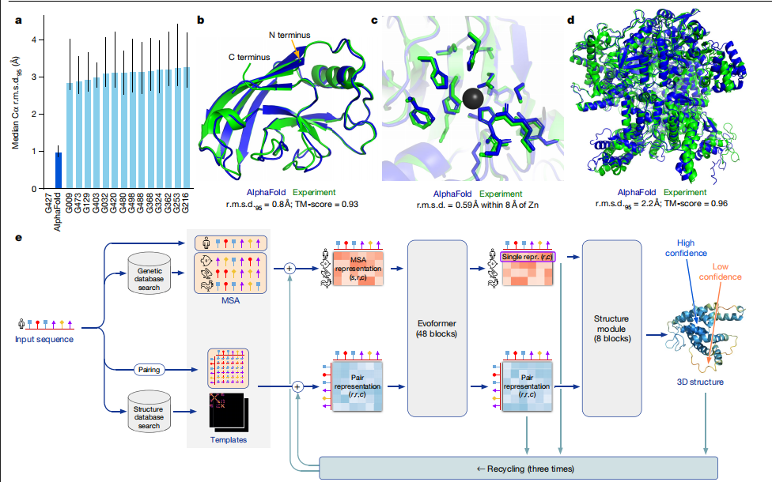
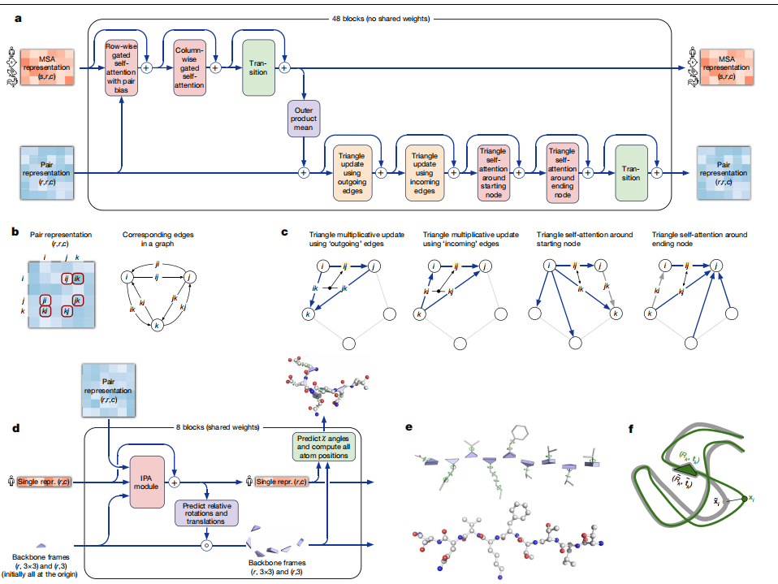

## 问题背景

蛋白质结构和功能密切相关，理解蛋白质结构对于解析其功能和机制至关重要。然而，实验测定蛋白质结构耗时耗力，远远无法满足日益增长的蛋白质序列数据的需求。

先前的计算方法：**基于物理相互作用的方法**，**基于进化历史的方法**

## 优势

- 高精度： AlphaFold 能够在大多数情况下以接近实验的精度预测蛋白质结构，即使在没有相似结构的情况下也能取得优异的结果。
  - **骨架精度**： AlphaFold 在 CASP14 测试集上的骨架精度中位数为 0.96 Å r.m.s.d.95，而排名第二的方法精度中位数为 2.8 Å r.m.s.d.95。这意味着 AlphaFold 的预测结果与实验结构更加接近。
  - **侧链精度**： AlphaFold 能够预测出非常精确的侧链结构，即使在没有模板的情况下也能取得优异的结果。
  - **全原子精度**： AlphaFold 的全原子精度中位数为 1.5 Å r.m.s.d.95，而排名第二的方法精度中位数为 3.5 Å r.m.s.d.95。
- 可扩展性： AlphaFold 可以应用于长链蛋白质和蛋白质复合物的结构预测。
- 可靠性： AlphaFold 能够提供每个残基的可靠性估计，方便用户判断预测结果的可靠性。

## 原理

AlphaFold 结合了生物信息学和物理学的原理，利用深度学习技术进行蛋白质结构预测。

展示了一种新的架构，用于将多序列比对 (MSA) 和成对特征联合嵌入，以及一种新的输出表示和相关损失，以实现准确的端到端结构预测，一种新的等变注意力架构，使用中间损失来实现预测的迭代细化，使用掩码 MSA 损失与结构联合训练，使用自蒸馏和无标签蛋白质序列学习来自我估计的准确性。

其核心创新包括：

- Evoformer 架构： 通过三角形更新和轴向注意力机制，有效地捕捉蛋白质序列之间的进化关系和空间关系。

- 端到端结构预测： 直接预测蛋白质三维结构，无需中间步骤。

- 自蒸馏和自估计： 利用无标签数据进行训练，进一步提高模型精度。

- 残基气体表示和等变注意力： 更好地处理蛋白质结构中的空间关系和局部特征。

  

## 数据

- **PDB**： 蛋白质结构数据库，用于训练和作为模板。
- **UniProt**： 蛋白质序列数据库，用于训练和构建 MSA。
- **UniRef90**： 蛋白质序列数据库，用于训练和构建 MSA。
- **BFD**： 蛋白质家族数据库，用于训练和构建 MSA。
- **Mgnify**： 宏基因组数据集，用于训练和构建 MSA。
- **HH-suite**： 用于进行蛋白质序列相似性搜索的工具。

## 网络结构

直接使用给定蛋白质的原始氨基酸序列和同源序列比对（aligned sequences ）作为输入，预测所有重原子的 3D 坐标。

### 网络的主体：

​	通过重复层处理输入，这些重复层由新型神经网络块**Evoformer** 组成，以生成一个 Nseq × Nres 数组 (Nseq，序列数；Nres，残基数)，表示处理后的 MSA（**多序列比对** ），以及一个 Nres × Nres 数组，表示残基对。MSA 表示初始化为原始 MSA。

​	Evoformer 块包含许多基于注意力和非注意力的组件。Evoformer 块中的关键创新包括在 MSA 和成对表示之间交换信息的新机制，这些机制能够直接推理空间和进化关系。

### 结构模块

​	以旋转和平移的形式引入一个显式的 3D 结构，对于蛋白质中的每个残基都有一个全局刚体框架。这些表示初始化为平凡状态，所有旋转都设置为恒等变换，所有位置都设置为原点，但会迅速发展和细化，形成具有精确原子细节的高精度蛋白质结构。

​	该网络这部分的关键创新包括打破链结构，以允许同时细化结构的所有部分。一种新的等变变换器，允许网络隐式推理未表示的侧链原子，以及一个将大量权重放在残基方向正确性上的损失项。

​	在结构模块以及整个网络中，通过反复将最终损失应用于输出，然后将输出递归地输入相同的模块，来加强迭代细化的概念。使用整个网络进行迭代细化（“recycling”）对准确性有很大贡献，而额外的训练时间很少。

### **Evoformer**

核心思想：将蛋白质结构的预测看作是三维空间中的一个图推理问题，其中图的边缘由邻近的残基定义。

- **节点和边**： Evoformer 将蛋白质序列中的每个残基视为节点，将残基之间的空间邻近关系视为边。
- **成对表示**： 成对表示存储关于残基之间关系的信息，例如距离、角度和相互作用力。
- **MSA 表示**： MSA 表示存储关于序列中每个残基的信息，以及这些残基在哪些序列中出现。
- **更新操作**： Evoformer 通过一系列更新操作来处理输入信息，包括：
  - **MSA 更新**： MSA 表示通过逐元素外积操作更新成对表示，并将结果在 MSA 序列维度上求和。
  - **三角形更新**： 成对表示中的信息通过三角形更新操作进行传播，这些操作考虑了三角形中缺失的边，并使用其他两条边的信息来推断缺失边的信息。
  - **轴向注意力**： Evoformer 使用轴向注意力机制来处理 MSA 表示和成对表示，并通过投影来自成对表示的额外 logits 来偏置 MSA 注意力，从而实现信息在两种表示之间的双向流动。

**2. Evoformer 的优势**

- **能够有效地捕捉蛋白质序列之间的进化关系和空间关系**。
- **能够生成高度精确的成对表示，为后续的结构预测模块提供丰富的信息**。
- **能够通过迭代更新操作不断细化预测结果，从而提高预测精度**。

### 

### 端到端结构预测

结构模块（图3d）在具体的3D骨干结构上操作，使用来自主干的多序列比对（MSA）表示中的成对表示和原始序列行（单一表示）。

3D骨干结构被表示为Nres个独立的角度旋转和平移，每个都与全局框架（残基气体）相关（图3e）。这些旋转和平移代表了N-Cα-C原子的几何形状，优先考虑蛋白质骨干的方向，使得每个残基侧链的位置在该框架内高度受限。相反，肽键几何形状完全没有约束，网络在应用结构模块期间经常违反链约束，打破这个约束可以无需解决复杂的环闭合问题，就能细化链的所有部分。在微调过程中，通过违反损失项来鼓励满足肽键几何形状。精确实施肽键几何形状仅在结构预测后的松弛阶段通过Amber32力场中的梯度下降实现。经验上，这种最终的松弛并不会提高模型的准确性，如通过全局距离测试（GDT）33或lDDT-Cα34测量，但它确实消除了分心的人为立体化学违规，而不会损失准确性。

残基气体表示通过两个阶段迭代更新（图3d）。首先，使用我们称为“不变点注意力”（IPA）的几何感知注意力操作来更新Nres个神经激活（单一表示），而不改变3D位置，然后在残基气体上执行等变更新操作，使用更新的激活。IPA在每个通常的注意力查询、键和值上增加了3D点，这些点是在每个残基的局部框架中产生的，使得最终的值对全局旋转和平移不变（详见“IPA”方法部分）。3D查询和键还在注意力上施加了强烈的空间/局部性偏差，这非常适合于蛋白质结构的迭代细化。在每个注意力操作和元素式转换块之后，模块计算每个骨干框架的旋转和平移的更新。在每个残基的局部框架中应用这些更新使得整体的注意力和更新块成为残基气体上的等变操作。

侧链χ角的预测以及结构的最终、每个残基的准确性（pLDDT）是在网络末端的最终激活上通过小型每个残基的网络计算得出的。TM-score（pTM）的估计是从成对错误预测中获得的，该预测是通过从最终的成对表示中的线性投影计算得出的。最终的损失（我们称之为框架对齐点误差（FAPE）（图3f））将预测的原子位置与在许多不同对齐方式下的真实位置进行比较。对于每种对齐方式，通过将预测框架（Rk, tk）与相应的真实框架对齐来定义，我们计算所有预测原子位置xi与真实原子位置的距离。由此产生的Nframes × Natoms距离通过截断的L1损失进行惩罚。这为原子相对于每个残基的局部框架的正确性以及与其侧链相互作用的正确性提供了强烈的偏差，同时也为AlphaFold提供了主要的手性来源（补充方法1.9.3和补充图9）。

## **训练和测试**

- **训练数据**： 使用来自 PDB 的蛋白质结构数据，以及从 UniProt、UniRef90、BFD 和 Mgnify 等数据库中收集的蛋白质序列数据。
- **训练过程**： 使用 FAPE 损失函数，并结合多种辅助损失函数，例如 distogram 预测、MSA 重建、lDDT-Cα 预测和侧链损失等。
- **自蒸馏**： 使用训练好的模型预测大量蛋白质结构，并将高置信度的预测结果作为新的训练数据，进一步提升模型精度。
- **测试数据**： 使用 CASP14 测试集和最近发布的 PDB 结构数据集进行测试。
- **测试指标**： 使用 lDDT-Cα、GDT 和 TM-score 等指标评估模型精度

## 应用前景

AlphaFold 的出现为结构生物学和生物信息学领域带来了巨大的机遇，可以广泛应用于以下领域：
蛋白质功能研究： 帮助科学家更好地理解蛋白质的功能和机制。
药物设计： 加速药物设计和开发过程。
疾病研究： 帮助科学家研究疾病的发病机制和治疗方法。
蛋白质工程： 帮助科学家设计和改造蛋白质。

## 总结

AlphaFold 的成功表明，深度学习技术在蛋白质结构预测领域具有巨大的潜力。随着技术的不断发展，AlphaFold 将在生命科学领域发挥越来越重要的作用，推动科学研究的进步。

## 涉及概念

### **三角形更新**

三角形更新基于以下观察：

- **三角形不等式**： 在三维空间中，任意两边之和大于第三边。这个原理适用于描述残基之间的距离关系。
- **成对表示的一致性**： 为了将成对表示表示为一个单个的三维结构，需要满足许多约束条件，包括三角形不等式。

三角形更新通过以下步骤进行：

- **选择三个相邻的残基**： 每个残基与其他两个相邻的残基形成一个三角形。
- **更新缺失的边**： 使用两个已知的边的信息来推断缺失的边的信息。
- **更新成对表示**： 使用更新后的边的信息来更新成对表示，例如距离、角度和相互作用力。

**优势**

- **保持成对表示的一致性**： 三角形更新确保了成对表示中残基之间距离关系的正确性，从而提高了预测结果的准确性。
- **提高模型的鲁棒性**： 三角形更新有助于模型更好地处理数据中的噪声和不确定性。
- **提高模型的效率**： 三角形更新是一种高效的更新操作，可以快速地传播信息，并更新成对表示。

**3. 三角形更新的应用**

三角形更新在 AlphaFold 的 Evoformer 模块中被广泛应用于多个方面，例如：

- **预测残基之间的距离**： 三角形更新可以预测残基之间的距离，并确保距离关系的正确性。
- **预测残基之间的角度**： 三角形更新可以预测残基之间的角度，并确保角度关系的正确性。
- **预测残基之间的相互作用力**： 三角形更新可以预测残基之间的相互作用力，并确保相互作用力的正确性。

### 成对表示（Pair Representation）

在 AlphaFold 的 Evoformer 模块中是一个核心概念，它指的是蛋白质中每对残基（氨基酸）之间的空间关系和相互作用的数学描述。以下是成对表示的具体内容：

1. **距离信息**：成对表示包含了两个残基之间的距离信息，这通常是一个数值，表示在三维空间中两个残基中心之间的欧几里得距离。
2. **角度信息**：除了距离，成对表示还可能包括两个残基之间的角度信息，这描述了它们在空间中的相对方向。
3. **相互作用力**：成对表示还可以包含残基之间的相互作用力，如氢键、疏水相互作用、范德华力等，这些力决定了残基如何在空间中相互吸引或排斥。
4. **方向向量**：有时候，成对表示会包括一个方向向量，它指向从一个残基到另一个残基的方向，这有助于确定残基在空间中的相对位置。

成对表示的例子：

- 对于残基 A 和 B，成对表示可能是 `(5 Å, 90°, 氢键)`，这意味着残基 A 和 B 之间的距离是 5 Å，它们之间的角度是 90°，并且存在一个氢键相互作用。

在 AlphaFold 的 Evoformer 模块中，成对表示是通过以下步骤生成的：

- **初始预测**：使用深度学习模型基于序列信息和其他生物信息学数据来预测初始的成对表示。
- **迭代优化**：通过三角形更新和其他更新操作，模型不断迭代优化这些成对表示，以提高预测的准确性。
- **结构生成**：最终，这些优化的成对表示被用来生成蛋白质的三维结构模型。

成对表示是 AlphaFold 能够准确预测蛋白质结构的关键，因为它们直接关联到蛋白质折叠过程中残基之间的相互作用和空间布局。通过精确地模拟这些关系，AlphaFold 能够重建出接近实验确定结构的蛋白质模型

### MSA

多序列比对（Multiple Sequence Alignment），是生物信息学中的一种基本技术，用于比较多个生物序列（如蛋白质或DNA序列），以识别它们之间的相似性和差异。以下是MSA的详细介绍：

**定义**

多序列比对是指将三个或更多的生物序列对齐，以便在序列中识别保守区域（即在不同序列中保持不变的区域）和变异区域。这些保守区域通常与序列的功能或结构特征有关。

- **发现同源序列**：识别并比较同一基因家族的不同成员。
- **识别保守区域**：找出在进化过程中保持不变的序列区域，这些区域可能对生物体的功能至关重要。
- **预测蛋白质结构**：保守区域可能对应于蛋白质的特定结构域或功能位点。
- **推断进化关系**：通过序列比对分析，可以构建物种之间的进化树，揭示它们的进化历史。

MSA有多种算法，以下是一些常用的方法：

- **动态规划算法**：如Needleman-Wunsch算法用于全局比对，Smith-Waterman算法用于局部比对。
- **基于启发式的方法**：如Clustal Omega和MAFFT，这些方法适用于大量序列的快速比对。
- **基于概率模型的方法**：如ProbCons和HAL，这些方法考虑了序列的进化概率模型。

在AlphaFold中，MSA的表示和更新是Evoformer模块的关键组成部分：

- **收集同源序列**：AlphaFold首先使用数据库搜索工具（如HHblits）来找到与目标蛋白质序列同源的序列。
- **构建MSA**：通过这些同源序列构建一个MSA矩阵，其中每一列代表一个残基位置，每一行代表一个序列。
- **MSA表示**：在Evoformer中，MSA表示存储了每个残基在不同序列中的出现信息，这有助于识别保守的残基和它们可能的相互作用。
- **MSA更新**：在Evoformer的迭代过程中，MSA表示通过逐元素外积操作与成对表示相互作用，并通过注意力机制更新，以细化对蛋白质结构的预测。

### 轴向注意力

在传统的自注意力机制中，每个元素（在 AlphaFold 的情况下是每个残基）会同时考虑与其他所有元素的关系。这在处理高维数据时，尤其是当序列长度很大时，会变得非常计算密集。轴向注意力通过将注意力计算限制在数据的特定“轴”或维度上，来减少这种复杂性。

1. **分割注意力计算**：
   - **序列轴（Sequence Axis）**：在处理MSA表示时，轴向注意力可以单独沿着序列的每个位置进行计算。这意味着对于MSA中的每个位置，模型会计算该位置上所有残基之间的注意力，而不是考虑整个序列。
   - **空间轴（Spatial Axis）**：在处理成对表示时，轴向注意力可以沿着残基对的空间关系进行计算，即分别考虑每个残基与其他残基的空间关系。
2. **局部注意力**：
   - 轴向注意力允许模型关注局部区域，例如，只考虑一个残基与其相邻残基之间的关系。这可以通过限制注意力窗口的大小来实现。
3. **逐元素外积操作**：
   - 在MSA表示中，轴向注意力通过逐元素外积操作来更新成对表示。这涉及到将MSA中表示残基信息的向量进行外积运算，然后将结果在序列维度上进行求和。
4. **信息传递**：
   - 轴向注意力机制允许信息在MSA表示和成对表示之间传递。例如，成对表示中的空间关系信息可以用来指导MSA表示中残基之间的注意力权重，反之亦然。

- **位置编码**：在轴向注意力中，可能包括位置编码来引入序列中残基的位置信息，这对于理解残基的上下文非常重要。
- **多头注意力**：轴向注意力可以是多头的，这意味着同时进行多组不同的注意力计算，每组关注不同的信息，然后将这些信息组合起来。
- **前馈网络**：在轴向注意力之后，通常会有前馈网络来进一步处理注意力输出，以生成更精细的表示。

### 