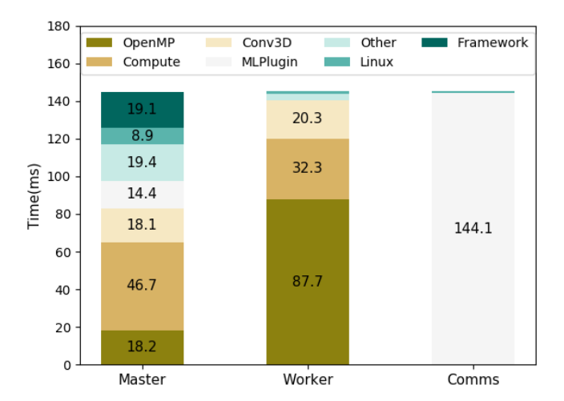

**CosmoFlow**

特点：一个基于 TensorFlow 架构的可扩展深度学习应用程序，旨在处理大规模 3D 宇宙数据集，并预测宇宙学参数。

目标：让深度学习网络适应多维度数据，并应用于宇宙学

#### **主要贡献**：

- 将 Ravanbakhsh 等人 (2017) 描述的深度学习网络扩展到更大规模 (128^3 体素) 并预测ΩM（宇宙中物质的比例）、σ8（宇宙质量波动的幅度）和ns（空间曲率的标量谱指数）参数。
- 在 MKL-DNN 中实现高效的 3D 卷积和池化操作，并在 TensorFlow 中进行优化，以提升在 Intel® Xeon Phi™ 处理器上的训练性能。
- 利用 Cray PE 机器学习插件，通过 MPI 实现高效的多节点扩展。
- 在 Cori 系统的 8192 个节点上实现了完全同步的数据并行训练，达到 77% 的并行效率，并实现了 3.5 Pflop/s 的持续性能。

#### **创新点**：

- 3D 卷积网络和数据集：将网络拓扑扩展到 128^3 体素，并通过添加额外的卷积层和池化层来管理参数数量。
- 优化器：使用 Adam 优化器结合 **LARC** 技术和**多项式学习率衰减**方案，以控制训练速度和稳定性。
- 单节点优化：在 MKL-DNN 中优化 3D 卷积和池化操作，并在 TensorFlow 中实现元素级操作的并行化。
- 多节点扩展：使用 Cray PE 机器学习插件实现高效的 MPI 通信，并通过非阻塞通信隐藏进程间时间不平衡。

#### **实验和结果**：

##### 网络结构：

- 7卷积，3全连接，3平均池化。在前人的工作基础上，修改CNN拓扑结构，增加卷积层、池化层和输出神经元的通道，来匹配参数要求
- 将所有卷积层的输出通道数增加为16个的倍数，以允许在通道维数上进行有效的向量化。
- 为了提高拓扑的缩放和计算性能，从拓扑中删除了batch-norm layers。batch size 固定为1

##### 训练：

完全同步化训练

##### 优化器：

combine Adam with the Layer-wise Adaptive Rate Control(LARC) [29] technique and a polynomial (power=1) learning rate decay schedule

##### 单节点优化：

- 使用 Intel® VTune™ Amplifier2018 [31] update 2 profiler分析网络拓扑，并使用 MKL-DNN进行优化。发现 TensorFlow 中的元素级操作是性能瓶颈之一。为了解决这个问题，使用 OpenMP 并行化这些元素级操作，以提高 TensorFlow 与 MKL-DNN 的兼容性，并提升 CosmoFlow 的性能。
- 将输入和输出按大小为16分块，匹配目标机器的单精度 SIMD，表示可以同时对 16 个浮点数进行操作。
- 将内循环完全展开，并使用了一个 JIT (Just-In-Time) 汇编框架将其向量化为 AVX512 SIMD 指令。JIT 框架可以在运行时动态生成汇编代码，并将其编译成可执行代码。这样可以确保生成的代码针对特定的硬件平台进行优化。
- 线程分解
- 对平均池化进行优化，主要解决内存性能问题

##### 多节点：

- 使用 CPE ML Plugin实现同步随机梯度下降（SSGD）：在 SSGD 中，每个节点在计算完梯度后，会等待其他所有节点完成梯度计算，然后将所有节点的梯度进行平均，最后使用这个平均梯度来更新模型参数。
-  CPE ML Plugin 利用辅助线程池来优化深度学习模型训练中的通信过程。并且CPE ML Plugin 通过自定义的 TensorFlow 操作将自己添加到 TensorFlow 图中。通过这种方式，CPE ML Plugin 可以直接访问 TensorFlow 的内存，从而最小化梯度数据的不必要复制。

##### 数据集：

- 使用MUSIC（MUlti-Scale-Initial-Conditions）包生成模拟的初始条件。

- 使用pycola包，一个多线程的Python/Cython N体代码，来实现Comoving Lagrangian Acceleration (COLA)方法，来生成暗物质模拟。COLA方法在保持大尺度N体精度的同时，比传统的N体模拟代码运行得更快。

- 模拟体积：512h−1Mpc³，包含512³个暗物质粒子。每个512h−1Mpc³的模拟立方体被直方图化成一个256³体素的3D粒子计数直方图。然后将这个体分成8个子体，每个模拟产生8×128³体素的子体，总共产生101,056个子体。

  

- 运行了12,632个模拟盒子，变化了ΩM（宇宙中物质的比例）、σ8（宇宙质量波动的幅度）和ns（空间曲率的标量谱指数）参数。

- 数据集划分：保留150个模拟（即1200个子体积）作为验证数据集，50个模拟（即400个子体积）作为测试数据集。剩下的99,456个子体积用于训练数据集，并且为了增强训练数据集，这些数据被复制了一次。

- **数据格式**：

  - 使用TFRecord文件格式：一种在TensorFlow中常用的简单面向记录的二进制格式。
  - 训练子体积被随机分配到TFRecord文件中，而验证和测试TFRecords则没有随机化或重复。
  - 每个TFRecord包含64个样本，大小为512MB。
  - TFRecord数据的总量为1.4TB。

##### 实验：

网络的总计算量为69.33 Gflop（浮点运算），需要28.15 MB的存储空间来存储参数。

**训练过程**：

- 使用Python和TensorFlow库在每个计算节点上启动CosmoFlow。
- 在TensorFlow中构建神经网络后，初始模型参数从排名0的节点广播到所有其他节点，确保所有节点开始时具有相同的模型。
- 每个节点进入一个循环，循环遍历所有训练周期（epochs），每个周期包含训练和验证循环。
- 每个循环的迭代次数由Niters = Nsamples/nranks定义，其中Nsamples是训练或验证样本的数量，nranks是节点的数量。
- 每个节点上的专用I/O线程从磁盘缓冲随机选择的样本到内存中，用于训练和验证
- 训练循环：梯度计算、通过MPI通信进行梯度平均以及从全局平均梯度更新模型
- 验证循环：损失计算和全局平均

##### 结果：

###### 单节点性能分析：

当增加节点数量时，节点间的通信时间会逐渐增加。但是，由于每个节点的批次大小保持不变，因此在规模扩大时，每个节点的计算部分在性能分析中的比例应该与单节点时相似。较大的卷积层实现了超过1 TFlop/秒的运算速度。

单节点运行中按计算单元划分的时间（主线程、工作线程和通信线程）：

- Linux调度器对于这个应用程序工作得很好，它将活跃的I/O线程和OpenMP主线程调度在同一个核心上，这在图中表示为“Master”列。
- 63个OpenMP工作线程（表示为“Worker”）和4个插件线程（表示为“Comms”）也被分配到单独的核心上。
- 元素级操作的来源包括泄漏ReLU的前向和反向传递（涉及调用两个ReLU和ReLUGrad操作），带有多项式衰减的Adam+LARC优化器，以及损失计算
- 这些函数都是使用OpenMP的循环级并行化单独线程化的

在单个KNL节点上，包括I/O和CPE ML插件的开销，实现了535 Gflop/s的性能。

###### 多节点性能分析

平均周期时间是从10个周期运行中的后8个周期取平均值，前两个周期不包括在内

###### **Cori系统的性能测量**：

- 在Cori上的第一组吞吐量测量是将训练数据存放在Lustre文件系统上。
- 图4的右图显示，超过512节点后扩展效果不佳，1024节点时的效率下降到58%以下。
- 为了研究这种扩展下降，进行了使用虚拟数据的测试（即不是从文件系统读取数据，而是在计算过程中生成数据），这表明I/O导致了显著的扩展下降。
- 为了克服读取带宽瓶颈，训练数据被放置在Cori的DataWarp“爆发缓冲区”（BB）文件系统上。
- 从BB文件系统获得更高的读取带宽后，、所有节点数量上的扩展效率提升，如图4的左部分所示。
- 在8192个KNL节点上实现了77%的扩展效率

###### **Piz Daint系统的性能测量**：

- 在Piz Daint上重复了吞吐量测量。图4的右图显示了将训练样本放在Piz Daint的Lustre文件系统上的结果。
- 如在Cori，512节点及以后可能遇到了读取瓶颈，在512节点数量时，扩展效率下降到44%。这与在Cori上使用Lustre文件系统时的扩展下降一致。

###### 正式运行：

整个运行大约花费了9分钟，其中8分钟是训练时间。实现了平均持续性能略超过3.5 Pflop/s的单精度浮点运算，对于8192个节点，相对于单个节点的并行效率为77%（加速比6324倍）。这个加速比是基于整个周期的计时。

网络在2048节点运行中用更少的epoch就收敛了

**思考**：

- I/O 是扩展性能的关键因素，DataWarp 文件系统对于提高扩展效率至关重要。

​	在128个MPI进程的情况下，使用DataWarp的绝对性能比使用Lustre提高了16%，这表明在那种规模下I/O已经成为一个瓶颈。在128个节点的情况下，使用DataWarp的步骤时间为150毫秒，而使用Lustre的步骤时间为179毫秒。

- Cray PE 机器学习插件能够有效地隐藏通信延迟，并实现高带宽的梯度聚合。

#### **结论**：

在2048节点运行中，(ΩM, σ8, ns)的相对误差分别为(0.0022, 0.0094, 0.0096)。这与最好的实验对于ns的误差几乎小了5倍。**准确性的提高可能是由于更大的模拟体积**，尽管网络被要求推断一个额外的参数。

#### **涉及的概念：**

##### MKL-DNN 

 Intel® Math Kernel Library for Deep Neural Networks 的缩写，它是一个开源的深度学习性能库，旨在加速深度学习应用程序在各种硬件平台上的运行。它提供了针对 Intel 处理器的优化，并支持多种深度学习框架，如 TensorFlow、PyTorch 和 Caffe。MKL-DNN 的核心思想是利用硬件加速和优化算法来提高深度学习计算的效率。

##### CPE ML Plugin

Cray Programming Environments Machine Learning Plugin (CPE ML Plugin) 

Cray 公司为超级计算机提供的一个插件，旨在加速深度学习应用程序的并行训练。

CPE ML Plugin 利用 MPI (Message Passing Interface) 进行进程间通信，并通过以下机制提高并行训练的效率：

- **高效的梯度聚合**： CPE ML Plugin 实现了高效的梯度聚合算法，可以快速地将不同节点上的梯度信息汇总起来，并进行全局更新。
- **非阻塞通信**： CPE ML Plugin 使用非阻塞通信机制，可以隐藏通信延迟，并提高并行训练的效率。
- **多线程通信**： CPE ML Plugin 使用多线程进行通信，可以进一步提高通信效率，并更好地利用多核处理器的能力。

##### Horovod

并行计算架构

##### element-wise operations

元素级操作是指对单个元素进行操作的运算，例如 ReLU 激活函数、Adam 优化器中的计算等。这些操作通常不涉及大规模数据，但它们在深度学习模型中非常频繁，因此对性能有很大影响

##### **OpenMP 并行化**

OpenMP 是一种用于并行编程的 API，它可以帮助开发者将串行代码转换为并行代码，从而利用多核处理器的能力。OpenMP 并行化可以显著提高程序的性能，尤其是在计算密集型任务中。

##### Cori System

美国高算

##### Piz Daint system

瑞士高算

##### MUSIC（MUlti-Scale-Initial-Conditions）

一个用于生成宇宙学模拟的初始条件的软件包。在宇宙学研究中，特别是在进行暗物质N体模拟时，需要设定宇宙的初始状态，这包括物质的分布、密度波动等。MUSIC专门设计用来创建这些初始条件，它能够根据宇宙学模型参数生成适合后续N体模拟的初始密度场。

MUSIC生成的初始条件可以用于多种N体模拟代码，以研究宇宙的结构形成和演化。通过使用MUSIC，研究人员能够在不同的尺度上设置初始条件，这对于模拟宇宙的大尺度结构（如星系团、超星系团和宇宙网）以及小尺度结构（如星系和暗物质晕）都是非常重要的。