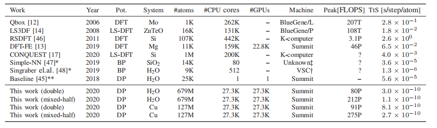
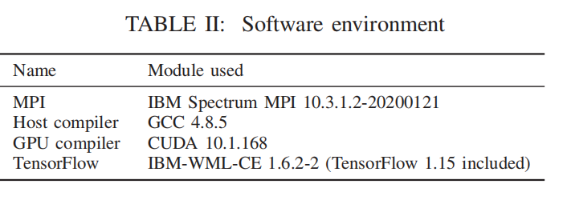
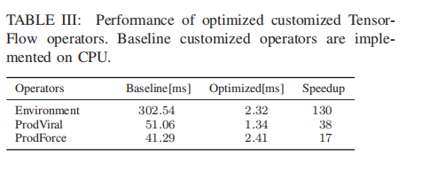
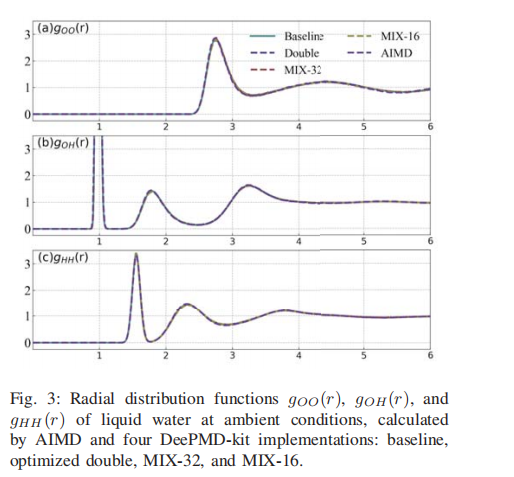
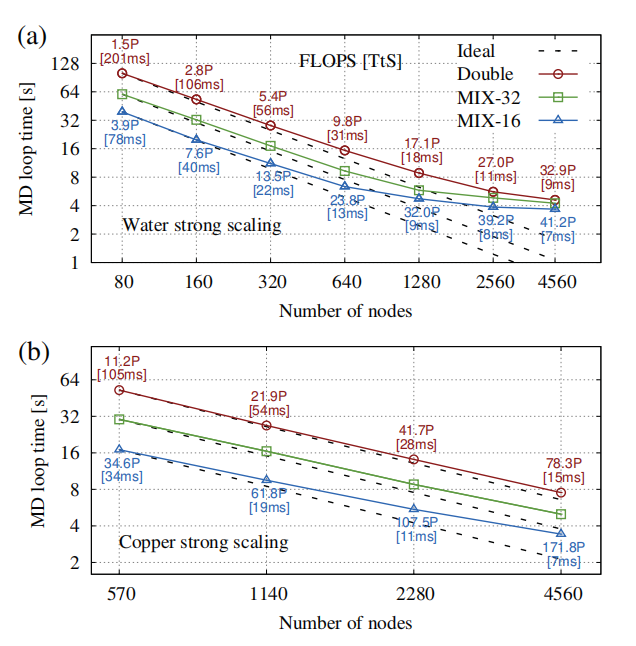
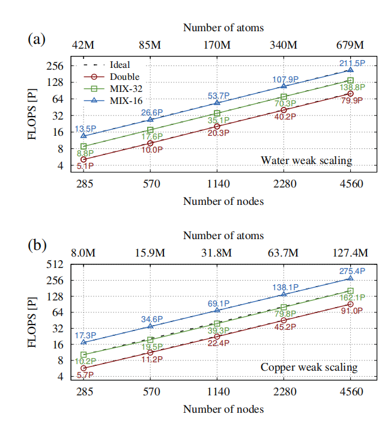
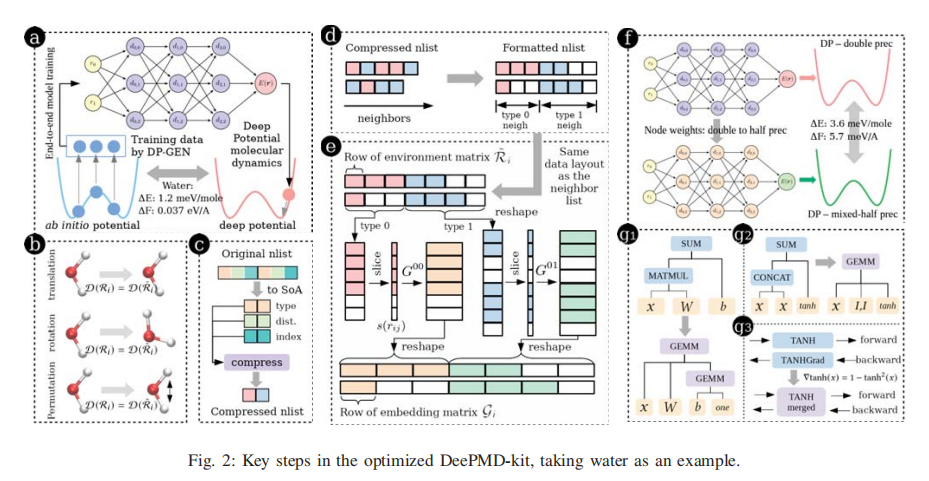
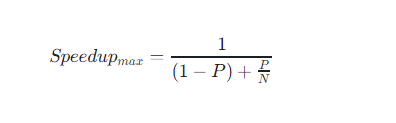

## 核心问题

使用深度学习模型（Deep Potential）和GPU加速的分子动力学模拟方法（Deep Potential Molecular Dynamics，DeePMD）

## 背景

- 传统的AIMD方法在模拟复杂原子现象方面具有高精度，但其计算成本限制了系统规模和模拟时间。

- 传统的AIMD方法通常只能模拟数千个原子系统，难以满足大规模模拟的需求

- 从 2006 年到 2019 年，世界上最快的超级计算机的峰值性能提高了约 550 倍（从 BlueGene/L 的 360 TFLOPS 到 Summit 的 200 PFLOPS），但可访问的系统规模只增加了 8 倍（从 1K 摩尔原子和 12K 价电子的钼 到 11K 镁原子和 105K 价电子 ）

- CCSD（T）精度高，但成本高

- **基于经验力场（EFF）**的MD方案，可以很容易地扩展到数百万个，甚至数万亿个原子，它们的准确性经常受到质疑
- EFFs能够得出纳米晶体的应力-应变曲线，通过分析位错和晶界的运动，可以阐明纳米晶体强度的来源。然而，EFFs最大的问题是对于某些属性，例如表面形成能和堆垛层错能，缺乏准确性

- 戈达德引入的**REAXFF方法**，能够模拟化学反应的反作用力场，缺乏DFT的通用性和预测能力

- MLMD目前的设计只面向CPU或台式GPU，没有面向高性能计算机

- DeePMD-kit，开源工具，由于初始设计问题，无法完全使用高性能计算机的性能。大规模的 DeePMD simulations先前只存在理论层面

- 具有*ab initio* accuracy的100 millions 规模的MD simulation从未被实现

## 贡献

一个高效、高度可拓展的、with ab initio accuracy的分子模拟方法：DP+Summit

- 通过引入一种**新的邻居列表数据布局**来增加DeePMD的计算粒度，这种布局避免了在计算嵌入矩阵时出现的分支 。注意到，由于描述符是排列不变的，不同顺序的邻居列表在准确性方面是等价的。重新设计了邻居列表的数据布局，通过按照邻居的类型进行排序，并且在每种类型内，我们按照它们的相对距离对邻居进行排序。
- 在新的邻居列表数据结构中，**元素被压缩成64位整数**。4位用于原子类型，10位用于原子距离，6位用于原子索引。更有效地优化自定义TensorFlow操作符的GPU。 这些操作符在基准DeePMD-kit中的总计算成本中占据了超过84%。并将所有运算放在GPU实现，并提前分配一大块GPU内存。
- 为DP模型开发了**混合精度计算**。计算密集型任务使用单精度或半精度进行，而不会降低物理可观测量的准确性。（在存储和计算过程中转化精度）混合精度和双精度在多个实验中表现相差无几。
- Tensorflow的运算优化。DeePMD-kit中的许多操作涉及到**高瘦矩阵的矩阵乘法**。这导致像SUM这样的操作产生了特别大的开销，二标准的TensorFlow操作符并未针对这种矩阵进行高效处理优化。重新设计TensorFlow执行图中的几个操作。 
  - 使用GEMM（通用矩阵到矩阵的乘法）**替换MATMUL和SUM操作符**。在优化的计算图中，使用单个CUBLAS GEMM调用来替换MATMUL和SUM操作符。
  - 使用GEMM**替换CONCAT和SUM操作符**。 通过将CONCAT替换为矩阵-矩阵乘法 (x, x) → x×(I,I) 来优化这个操作，并将这个乘法与SUM合并形成一个CUBLAS GEMM调用（见图2 (g2)）。我们观察到，这种乘法只比CONCAT快一点点，好处来自于SUM的合并。
  - CUDA内核融合用于**TANH和TANHGrad**： TANH是激活函数，TANHGrad是TANH输出的相对于输入的导数，用于反向传播。在每个MD步骤中，我们需要TANH和TANHGrad来评估力。观察到tanh(x)的导数也是tanh(x)的函数，即 ∇tanh(x)=1 − tanh²(x)。因此，可以将TANH和TANHGrad操作符都在一个CUDA自定义内核中实现。由于TANHGrad的GPU内存是在前向传播中分配的，这种优化本质上是**以空间换时间**。
- 降低MPI的通信瓶颈。
  - 在LAMMPS中计算EFF的操作被替换为计算DP，同时LAMMPS也用于维护系统的空间分区以及所有子区域之间的通信。
  - 在每个DeePMD步骤中，主要有两种MPI通信类型：相邻MPI任务之间的幽灵区域通信和用于物理性质的全局规约操作。
  - 由于幽灵区域（ghost area）在计算过程中位于GPU上，使用支持CUDA的IBM Spectrum MPI来优化幽灵区域的通信。当需要输出信息时，会在所有MPI任务之间执行MPI Allreduce操作，以汇总物理性质。
  - 尽管这些物理性质每个只包含一个双精度数字，并且相应的MPI Allreduce操作主要受延迟影响，但在极端大规模计算中，优化的DeePMD-kit的扩展性会受到隐式MPI Barrier的限制。为了缓解这个问题，我们减少了输出频率，每隔20个步骤输出一次。此外，**使用MPI Iallreduce替换了MPI Allreduce**，非阻塞式，以进一步避免隐式MPI Barrier。

## 实验结果

规模、时间、精度上的突破

在Summit超级计算机上实现了91 PFLOPS的双精度峰值性能(45.5% of the peak)，162/275 PFLOPS 混合精度

DeePMD方法能够模拟超过1亿个原子的系统，在混合精度下模拟时间缩短至纳秒级别。

### 和最先进成果对比

### 测试对象：

​	邻居列表每50步更新一次，缓冲区域为2 Å。热力学数据，包括动能、势能、温度、压力，每20个时间步收集并记录一次。

- ​	水：弱非共价分子间相互作用、热（熵）效应以及核量子效应之间的微妙平衡。水系统包含4,259,840个分子（12,779,520个原子），500 MD步骤的总浮点运算次数为151.1 PFLOPs。

- ​	铜：表面形成能和堆积断层能。用最新的方法生成训练数据。铜系统的强缩放测试使用15,925,248个原子的系统，500 MD步骤的总浮点运算次数为588.7 PFLOPs

### 实验环境

HPC：Summit

软件环境：

 6 MPI 任务一个计算节点，每个MPI任务一个单独的GPU

评估：

​	用NVIDIA CUDA NVPROF tool来收集FLOP（只能收集GPU上的）

标准：

​	时间、巅峰性能、一般性能

### 单GPU下：

1. 自定义TensorFlow操作符：

   在基准实现中，自定义TensorFlow操作符占用了12,288原子水系统总MD循环时间的约85%。对于所有自定义TensorFlow操作符，整体加速了64.6倍。“MD循环时间”的总加速因子达到了6.2。

   

2. 标准TensorFlow操作符：一些标准TensorFlow操作符被重新实现并优化。对于12,288原子的水系统，基准实现中的MATMUL+SUM、CONCAT+SUM和TANH+TANHGrad分别通过GEMM、GEMM和合并的TANH加速了1.3、1.7和1.6倍。"MD循环时间"额外加速了1.21倍。

3. 混合精度：以水为例，测试数据集由64分子的100个水配置组成。MIX-32方案与双精度一样准确。MIX-16的精度略低于双精度模型。为了进一步检查准确性，我们计算了径向分布函数（RDF），即在球平均距离r处找到相邻原子的归一化概率。氧-氧、氧-氢和氢-氢 RDF通常用于表征水的结构。从混合精度实现（MIX-32和MIX-16）计算的RDF与双精度实现和AIMD计算的RDF完全一致。

   因此，混合精度方法不会导致预测物理可观测量时精度的损失。

   

   优化后的DeePMD-kit双精度版本比基准代码快约7.5倍，当使用MIX-32和MIX-16代码时，加速因子分别提高到12.7和19.5

   ### 扩展性

   在Summit超级计算机上针对大规模模拟优化的DeePMD-kit的扩展行为。从800万到679百万个原子。

   #### 强扩展性：

   测量了优化的DeePMD-kit的扩展性，测试了从80到4560个计算节点的500个MD步骤的“MD循环时间”。测试系统包括一个含有15,925,248个原子的铜系统和12,779,520个原子的水系统。

   

   ### 弱扩展性：

   测量水和铜系统在500个MD步骤中的FLOPS来评估。

   两个系统都显示出了与使用的节点（GPU）数量**完美扩展**。比具有从头计算精度的最先进MD方案大三个数量级。

   在Summit的4560个计算节点上，MIX-32和MIX-16代码的计算可行系统尺寸可以分别增加到13.5亿和27亿个原子，并将最终受到GPU内存容量的限制。

   
   
   ###  持续性能
   
   - 设置时间：通过从总时间中减去MD循环时间，主要包括原子结构的初始化和DP模型数据的加载。例如，在Summit上的4560个计算节点上，127,401,984个原子的铜系统的设置时间超过263秒。
   
   - 为了减少这些开销，让所有MPI任务在不进行通信的情况下构建原子结构，模型数据也是通过首先由单个MPI等级读取，然后广播到所有MPI任务中进行预加载。通过这些优化，设置时间减少到所有测试中不到5秒。
   - DeePMD-kit的持续性能在运行127,401,984个原子的铜系统进行5000个MD步骤（5 ps）时，达到了90.3 PFLOPS（峰值的45%）。

### 可拓展的领域

复杂的化学反应，电化学电池，纳米晶体材料，辐射损伤以及动态断裂和裂纹扩展

## 涉及的概念

### DP 

指深度势能（Deep Potential）方法，它是一种基于深度学习的分子动力学模拟方法。DP模型的创新之处在于它能够自动地从每个原子的局部环境（由环境矩阵Ri描述）通过嵌入网络生成一组保持对称性的描述符D。通过使用大致相同的超参数集，DP能够拟合几乎所有测试过的系统数据。

**DP 方法的原理**：

- DP 方法使用深度神经网络（DNN）来学习原子间的相互作用势能函数，并用于模拟原子和分子的运动。
- DP 方法的 DNN 通常由嵌入网络和拟合网络组成，嵌入网络将原子环境的特征编码成低维向量，拟合网络根据这些向量预测原子间的相互作用势能。
- DP 方法可以模拟各种类型的原子和分子，包括金属、绝缘体、半导体和生物分子等。

**DP 方法的优势**：

- **高精度**： DP 方法可以提供与从头算分子动力学相当的精度，同时具有更高的计算效率。
- **可扩展性**： DP 方法可以扩展到非常大的系统，例如数百万个原子。
- **泛化能力**： DP 方法可以用于模拟不同的系统和过程，例如金属、绝缘体、半导体和生物分子等。

**DP 方法的局限性**：

- **计算成本**： DP 方法的计算成本仍然比较高，需要高性能计算机进行模拟。
- **模型训练**： DP 方法的模型训练需要大量的计算资源和数据。
- **泛化能力**： DP 方法的泛化能力可能受到训练数据的影响。

### Molecular dynamics (MD)

一种在计算机上模拟原子和分子运动的方法，用于研究物质的结构、性质和动力学行为。

- MD模拟基于经典力学原理，将原子和分子视为质点，并根据其相互作用力和初始条件，计算其在特定时间内的运动轨迹。
- MD模拟通常使用牛顿运动方程来描述原子和分子的运动，并通过数值积分方法求解这些方程。

### AIMD

AIMD的计算成本通常随着电子自由度的数量呈立方增长

### 线性缩放密度泛函理论

- 传统 DFT 方法的计算复杂性通常随着电子数的 N^3 增长，限制了其在大规模系统中的应用

- 线性缩放 DFT 方法通过多种策略降低计算复杂性，使其接近线性增长。
- 常用的策略包括：
  - **分块算法**： 将系统分解成小块，独立计算每个小块的电子结构。
  - **稀疏矩阵技术**： 利用电子结构矩阵的稀疏性，减少计算和存储需求。
  - **快速傅里叶变换 (FFT)**: 利用 FFT 计算电子密度和势函数的空间分布。
  - **机器学习方法**： 使用机器学习模型预测电子结构，从而减少 DFT 计算次数。

### CCSD(T) 

耦合簇单双激发加上三重激发，一种用于计算分子电子结构的量子化学方法

- CCSD(T) 方法基于耦合簇理论，将分子中的电子分为占据轨道和虚轨道，并通过构建电子激发态的波函数来描述电子的运动。
- CCSD(T) 方法考虑了单激发态和双激发态，并使用迭代方法计算激发态的能量和波函数。
- CCSD(T) 方法可以进一步扩展，考虑三重激发态，从而提高计算精度。

**CCSD(T) 的局限性**：

- **计算成本高**： CCSD(T) 方法的计算成本非常高，难以模拟大规模系统或长时间尺度。
- **效率低**： CCSD(T) 方法的计算效率较低，需要高性能计算机进行模拟。

### REAXFF 

一个用于分子动力学模拟的力场，它是一种反应力场，可以模拟化学反应过程。

**REAXFF 的特点**：

- **反应性**： REAXFF 力场考虑了化学反应过程，可以模拟原子和分子之间的化学键的形成和断裂。
- **准确性**： REAXFF 力场具有较高的精度，可以模拟各种化学反应，例如燃烧、氧化、还原等。
- **可扩展性**： REAXFF 力场可以扩展到非常大的系统，例如数百万个原子。

- **精度有限**： REAXFF 力场的精度可能低于一些基于第一性原理的计算方法。
- **参数化复杂**： REAXFF 力场的参数化比较复杂，需要大量的实验数据来验证和优化。

### Summit 

一台超级计算机，位于美国橡树岭国家实验室（Oak Ridge National Laboratory, ORNL）。世界上性能最强大的超级计算机之一。它是由 IBM 公司建造的，使用了 Power9 处理器和 NVIDIA Volta GPU 加速器。

- **峰值性能**：Summit 的峰值性能超过 200 PFLOPS（每秒浮点运算次数达到 200 万亿亿次），在 LINPACK 测试中达到了大约 148.6 PFLOPS。
- **节点数量**：Summit 由超过 4,600 个计算节点组成，每个节点包含两个 Power9 CPU 和六个 NVIDIA Volta GPU。
- **内存和存储**：Summit 拥有超过 10 PB 的内存和超过 250 PB 的存储空间。
- **应用领域**：Summit 被用于各种科学研究，包括模拟宇宙演化、分析大规模基因组数据、研究新材料特性等。

### AoS和SoA

是两种不同的数据布局方式，它们在内存中存储复杂数据结构的方式不同

- 在AoS布局中，每个结构体实例连续存储在内存中。这意味着一个对象的的所有属性都紧密地放在一起。

- 在SoA布局中，每个结构体的属性被分开存储在单独的数组中。这意味着所有对象的同一个属性都连续存储在一起。

### 阿姆达尔定律（Amdahl’s Law）

用来描述在并行计算中，程序加速的潜在上限。这个定律由计算机架构师吉恩·阿姆达尔（Gene Amdahl）在1967年提出。

阿姆达尔定律的基本公式是：

其中：

- Speedup_max 是程序加速的最大倍数。
- P是程序中可以并行化的部分的比例。
- N是并行处理器的数量。

阿姆达尔定律说明了以下几点：

- 即使你可以将程序的某个部分加速很多倍，这个加速对整体性能的影响也受限于该部分在整体程序中所占的比例。
- 如果程序中有一些部分无法并行化（即 P*P* 不等于 1），那么增加处理器数量并不会无限制地提高程序的执行速度。
- 当 N趋于无穷大时，Speedup_max 的极限是 1/1−*P*，这意味着即使有无限多的处理器，也无法完全消除程序中的串行部分对性能的影响。

### LAMMPS

一个开源的分子动力学（MD）模拟软件，主要用于材料科学、物理学、化学和生物物理学领域的研究。它能够模拟原子、离子、分子及其组合在时间和空间上的运动，以此来研究物质的宏观性质如何从微观层面上产生。

1. **大规模并行计算**：LAMMPS设计用于在并行计算环境中运行，可以在高性能计算集群、多核工作站或超级计算机上高效运行，支持数千至数百万个原子的模拟。

2. **多种力场和支持的模型**：LAMMPS支持多种原子间相互作用力场，包括经典分子动力学力场、反应力场、粗粒化模型等，适用于不同类型的系统模拟。

3. **灵活性和可扩展性**：LAMMPS具有模块化设计，用户可以根据需要添加新的力场、修复（fix）功能、计算（compute）功能和诊断工具。

4. **广泛的适用性**：LAMMPS可以用于固体、液体、气体以及它们之间的相变研究，也可以用于模拟表面科学、生物分子、聚合物、纳米材料等问题。

   

### MPI Allreduce

MPI中的一个操作

1. **归约（Reduce）**：每个进程都有一个输入数据（通常是一个数组或单个值），Allreduce操作首先在每个进程中局部执行一个归约操作（如求和、乘积、最大值、最小值等），将每个进程的数据归约成一个值。
2. **全归约（Allreduce）**：然后，将所有进程的局部归约结果再进行一次归约操作，得到一个全局归约结果。
3. **广播（Broadcast）**：最后，将这个全局归约结果广播到所有参与的进程中，使得每个进程都得到这个最终的全局归约结果。

`MPI_Iallreduce` 是 MPI中的一个非阻塞版本的 `MPI_Allreduce` 操作。`MPI_Allreduce` 是一个同步操作，它会在操作完成之前阻塞调用它的进程。而 `MPI_Iallreduce` 允许进程在归约操作进行时继续执行其他任务，即它不会阻塞调用它的进程。

### Velocity-Verlet

一种数值积分方法，常用于分子动力学模拟中，用来求解牛顿运动方程。这种方法是一种改进的Verlet算法，它结合了速度项，因此能够更精确地计算粒子的位置和速度。

Velocity-Verlet方案之所以受欢迎，是因为它简单、稳定，并且能够保持系统的动量守恒。它不需要存储前一时间步的加速度，因此在计算资源上比其他一些方法更为高效。此外，它也适用于求解各种不同的物理系统，包括非保守力系统。

直击用户痛点 motivation

开创性

difficulties是否一一解决

是否和SOTA对比

solution 是否容易实现和接受

evaluation

验证有效：baseline，dataset，各个方面的效果

共性、优势、缺点

