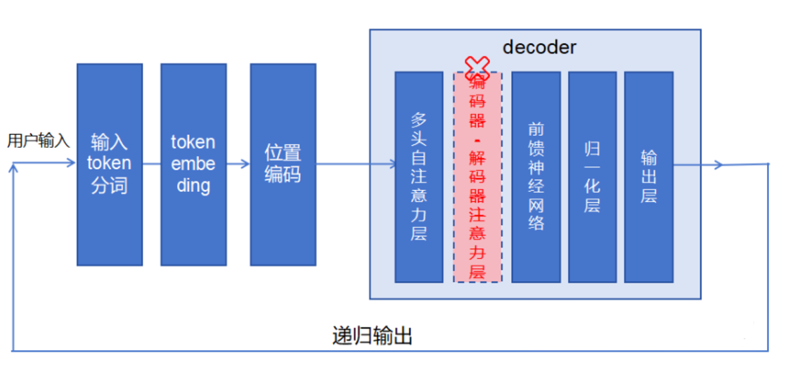
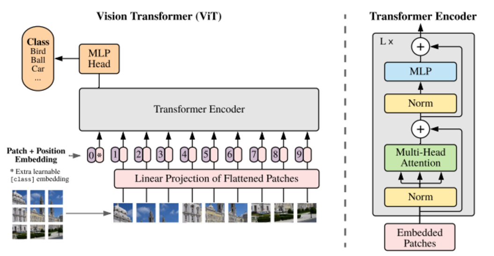
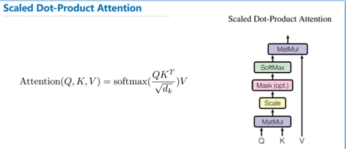

## LLM

### Encoder-only

​	Encoder-only模型，如**BERT**，主要用于理解和提取输入文本中的相关信息。这个过程通常涉及到处理文本的序列化形式，例如单词或字符，并且用自注意力机制（Self-Attention）来理解文本中的上下文关系。
​	BERT只使用了Transformer模型中的编码器部分，因为它主要用于处理单向输入数据。BERT的预训练目标是通过掩盖部分输入来预测其他部分，即完形填空，或者预测两个句子之间的关系，这些任务并不涉及到生成输出序列的自回归任务，因此不需要解码器。

### Decoder-only

​	Decoder-only模型主要是为了预测下一个输出的内容/token是什么，并把之前输出的内容/token作为上下文学习。
​	在Transformer模型的解码器中，**自注意力机制允许每个位置的输出都依赖于输入序列中所有位置的信息**。然而，当生成输出序列时，**我们希望位置i的输出只依赖于位置i之前的已知输出**，而不依赖于位置i之后的输出。为了实现这一点，Decoder使用了一种“掩码”技术（attn_mask），阻止模型关注位置i之后的位置。

​	和en-de模型相比，de模型用户输入直接作为 Decoder 的输入，**在自注意力机制中隐式完成理解和建模**，同时为生成任务提供基础。在自注意力层完成以下操作

- 输入序列的每个 Token 通过自注意力机制与整个序列中的其他 Token 进行交互。
- 自注意力机制计算了每个 Token 与其他 Token 之间的相关性（即注意力权重），从而捕获输入序列的上下文关系和全局语义信息。

​	**局限性：**

​	**1、输入长度受限于生成长度**

​		Decoder-Only 模型处理用户输入时，将输入视为生成序列的开头部分，与未来生成的内容共享同一序列窗口。如果输入非常长，可能会占用较多的序列窗口空间，导致对上下文信息的捕捉不完整。
例如，GPT 模型可能在处理特别长的输入时无法很好地捕捉全局上下文。

​	**2、隐式建模输入语义**

​		用户输入的理解与生成目标共享同一个模块（自注意力机制）。这种共享机制可能在生成复杂输出时分散注意力，导致对输入的理解不够精确。

​	**3、缺乏明确的输入表示优化**

​		Decoder-Only 模型没有独立优化输入表示的过程，这可能导致它对长文本、复杂结构输入的处理效果逊色于 Encoder-Decoder 模型。

### Encoder-Decoder

​	充分利用了上面2种类型的优势，采用新的技术和架构调整来优化表现。这种主要用于NLP，即理解输入的内容NLU，又能处理并生成内容NLG，尤其擅长处理输入和输出序列之间存在复杂映射关系的任务，以及捕捉两个序列中元素之间关系至关重要的任务。
T5、BART

### ViT

​	Transformer 架构在视觉上任务上，注意力机制要么与卷积网络结合使用，要么用于替换卷积网络的某些组件，同时保持其整体结构。

​	这种对 CNNs 的依赖是不必要的，直接应用于**图像块序列  (sequences of image patches)** 的纯 Transformer 可以很好地执行图像分类任务。

#### Background

​	在 CV 中，卷积架构仍然占主导地位。受到 NLP 成功的启发，多项工作尝试将类似 CNN 的架构与自注意力相结合，有些工作完全取代了卷积。**后一种模型虽然理论上有效，但由于使用了特定的注意力模式，尚未在现代硬件加速器上有效地扩展。**因此，在大规模图像识别中，经典的类 ResNet 架构仍是最先进的。

​	应用于图像的简单自注意力要求每个像素关注所有其他像素。由于像素数量的二次方成本，其无法放缩到符合实际的输入尺寸。Parmar 等人只在每个 query 像素的局部邻域而非全局应用自注意力，这种局部多头点积自注意力块完全可以代替卷积。在另一种工作中，稀疏 Transformer 采用可放缩的全局自注意力，以便适用于图像。另一种方法是将其应用于大小不同的块中，在极端情况下仅沿单个轴。**许多这种特殊的注意力架构在 CV 任务上显示出很好的效果，但是需要在硬件加速器上有效地实现复杂的工程。**

#### 实现方法

​	遵循原始 Transformer (Vaswani 等, 2017)。 这种有意简单设置的优势在于：可扩展的 NLP Transformer 架构及其高效实现几乎可以开箱即用。

- 将图像为一个flatten的 2D patches 序列，作为输入
- Transformer 在其所有层中使用恒定的隐向量（大小为D），将图像 patches 展平，并使用可训练的线性投影 (FC 层 ***\*Learnable Embedding\****) 将维度映射成D维，输出就是图像块嵌入（patch embedding），类似词嵌入

##### 可学习的嵌入learnable embedding

​	类似于 BERT 的类别 token [class]，此处 为图像 patch 嵌入序列预设一个 可学习的嵌入，该嵌入在 Vision Transformer 编码器输出的状态/特征，用作图像表示 y。无论是预训练还是微调，都有一个分类头(Classification Head) 附加在之后，从而用于图像分类。

​	在预训练时，分类头为 一个单层 MLP；在微调时，分类头为 单个线性层 (多层感知机与线性模型类似，区别在于 MLP 相对于 FC 层数增加且引入了非线性激活函数，例如 FC + GELU + FC 形式的 MLP)。

##### 位置嵌入 (Position Embeddings)

- 不同于 CNN，Transformer 需要位置嵌入来编码 patch tokens 的位置信息，这主要是由于 自注意力 的 扰动不变性 (Permutation-invariant)，即打乱 Sequence 中 tokens 的顺序并不会改变结果。

- 若不给模型提供图像块的位置信息，那么模型就需要通过图像块的语义来学习拼图，这就额外增加了学习成本。几种不同的位置编码方案：

  - 无位置嵌入

  - 1-D 位置嵌入 (1D-PE)：考虑把 2-D 图像块视为 1-D 序列
  - 2-D 位置嵌入 (2D-PE)：考虑图像块的 2-D 位置 (x, y)
  - 相对位置嵌入 (RPE)：考虑图像块的相对位置

- 输入 Transformer 编码器之前直接 **将图像块嵌入和位置嵌入按元素相加**

##### 编码器

​	**Transformer 编码器** 由交替的 **多头自注意力层** (MSA) 和 **多层感知机块** (MLP) 构成。在每个块前应用 **层归一化 (Layer Norm)**，在每个块后应用 **残差连接 (Residual Connection)**。

​	最终提取可学习的类别嵌入向量 —— class token对应的特征用于 图像分类

#### 实验

​	在没有强正则化的中型数据集（如 ImageNet）上进行训练时，这些模型产生的准确率比同等大小的 ResNet 低几个百分点。原因：Transformers 缺乏 CNN 固有的一些**归纳偏置 (inductive biases)** —— 如 **平移等效性** 和 **局部性 (translation equivariance and locality)**，因此在数据量不足时，训练不能很好地泛化。 

 	**大规模训练的效果胜过归纳偏置**。**若先在较大的数据集上预训练，然后再对特定的较小数据集进行微调，则效果优于 ResNet**。当在ImageNet-21k 数据集或 JFT-300M 数据集上进行预训练时，ViT 在多个图像识别基准上接近或击败了最先进的技术。

