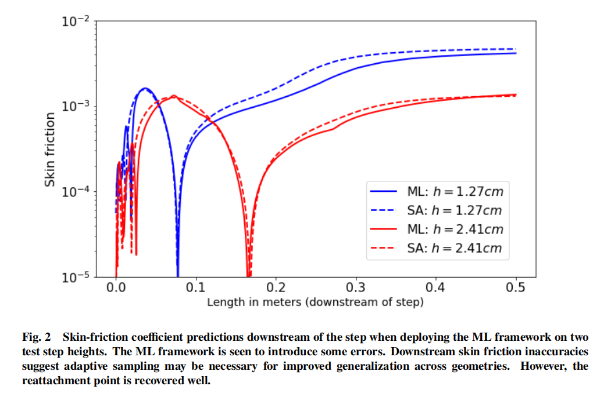

### 成果：

​	提出一个openfoam的内部模块，允许将模型部署在预测任务上。

​	即：将openfoam和tensorflow耦合在一起

### 过程：

1. 将模型从python中导出
   1. 冻结模型权重（导出一个gragh结构）
   2. 将训练好的神经网络模型冻结到 protobuffer 格式。即将模型的参数（权重和偏置）固定下来，并将整个模型结构转换成一个优化的、可移植的文件格式，称为 protobuffer，这样就可以使用C语言调用
2. tensorflow的C语言的api
   1. 加载图
   2. 在使用 TensorFlow C API 在 C++ 中进行推理时，需要使用 Python 模型中定义的操作名称来识别 C++ 代码中的操作
   3. 在 C++ 中使用 TensorFlow C API 进行推理时，需要创建一个会话（TFSession），然后使用该会话来运行图（TFGraph）
3. 编译
   1. 在 Make/Options 文件中为 OpenFOAM 提供 TensorFlow C API 的路径
   2. 在模型的目录中运行 `wmake` 命令来编译湍流模型

### 实验

#### 环境：

 约 1.90GHz 时钟速度的 8 代 Intel Core i7 处理器；OpenFOAM 5.0

#### **Science driver 1:**

- Surrogate modeling for steady-state turbulent eddy-viscosity（稳态湍流涡粘性）

- 通过直接预测稳态湍流涡粘性（作为初始条件的函数）来加速RANS（雷诺平均纳维尔斯托克斯）模拟。在文章  “A turbulent eddy-viscosity surrogate modeling framework for Reynolds-Averaged Navier-Stokes simulations,” *Computers & Fluids*, 2020, p. 104777.

- 训练数据：通过在不同的几何形状上使用Spalart-Allmaras模型进行多次RANS模拟获得

- 实验结果：求解时间显著减少，尽管误差有所增加

  

#### **Science driver 2:**

- **Surrogate modeling of dynamic Smagorinsky coefficient**（动态Smagorinsky系数）
- 模型基于每个网格单元中心的应变率张量以及三个速度分量的瞬时测量值
- 训练数据：由动态Smagorinsky本身生成的（即，使用基于标准尺度相似性的最小二乘计算，遵循测试过滤）
- 实验结果：
  - ML代理模型在不使用测试过滤的情况下恢复了与动态Smagorinsky相似的性能
  - 在单个节点上（与之前用于RANS实验的节点相同）求解两种情况的计算时间分别为1348秒（动态Smagorinsky）和1297秒（ML代理），假设物理求解时间为1000秒

### 涉及的概念：

#### protobuffer 格式

是一种跨平台的格式，可以在不同的操作系统和编程语言中使用。

#### **steady-state turbulent eddy-viscosity**

1. **湍流的基本特征**：湍流流动是由许多不同尺度的涡旋组成的，这些涡旋不断地生成、发展和消散。这些涡旋的运动导致了流线之间的混合和动量的交换。
2. **涡粘性的概念**：在层流中，粘性力可以通过分子运动来解释。然而，在湍流中，除了分子粘性之外，还存在一种额外的粘性效应，即涡粘性。这种效应不是由分子运动引起的，而是由湍流涡旋的集体运动引起的。
3. **稳态湍流**：稳态湍流是指流动参数（如速度、压力等）随时间不发生变化的状态。尽管流动本身是复杂的，但在稳态条件下，这些参数的统计特性是恒定的。
4. **涡粘性系数**：在湍流模型中，涡粘性通常用一个被称为涡粘性系数（eddy viscosity coefficient）的参数来表示，记作ν_t或μ_t。这个系数是一个假想的粘性系数，它被用来在Navier-Stokes方程中模拟湍流效应。
5. **作用**：涡粘性系数在湍流模型中起到了模拟湍流应力（即雷诺应力）的作用。它使得我们可以使用修改后的Navier-Stokes方程来描述湍流流动，这些方程包含了额外的湍流应力项。
6. **模型应用**：在工程应用中，涡粘性模型被广泛用于计算流体动力学（CFD）模拟中，以预测和分析湍流流动。常见的涡粘性模型包括Spalart-Allmaras模型、k-ε模型、k-ω模型等。

简而言之，稳态湍流涡粘性是一个用于描述湍流流动中由于涡旋运动引起的额外粘性效应的参数，它是湍流模型中的一个关键组成部分，用于在数值模拟中近似湍流应力。

#### Smagorinsky系数

Smagorinsky系数是一个用于大涡模拟（LES）的模型参数，它影响亚格子尺度湍流的模拟。动态Smagorinsky系数不是固定的，而是在模拟过程中根据流场特性动态调整的。

