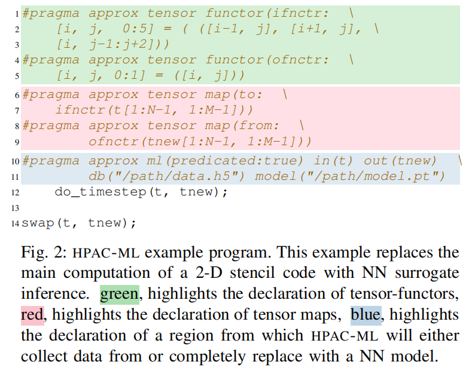
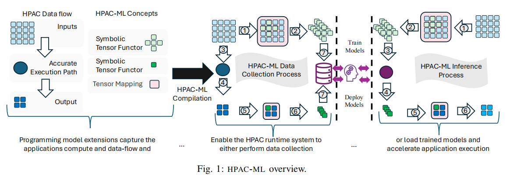

## 目标问题： 

将机器学习模型嵌入科学计算应用中，以加速计算过程，并提高效率。

## SOTA：

**HPAC**:  **High-Performance Approximate Computing**，允许在同一个二进制文件中存在准确和近似版本的算法，并在运行时根据条件选择执行路径。
**HPAC-Offload:** 将近似计算扩展到 GPU 上。
**Auto-HPCnet**: 使用客户端-服务器协议实现基于神经网络的近似模型，但缺乏集成支持，并存在通信开销。
**Myers et al.** : 开发 Python 绑定作为 AMR 模拟数据和数据科学软件之间的桥梁，但没有利用最新的 ML 库。

## Difficulties：

1. 集成 ML 模型需要手动操作，复杂且易出错，需要应用和 ML 两方面的专业知识。
2. 科学应用通常使用高性能语言开发，而 ML 模型需要在其生态系统内调用，增加了集成复杂性。
3. 缺乏易于使用的编程模型和语言，比如对需要加速的代码块位置和数据流的标注，限制了 ML 模型在 HPC 中的应用。

## 解决办法：

1. HPAC-ML: 基于 HPAC，提供基于指令的编程模型，允许开发者轻松地将 ML 模型嵌入科学应用中。

2. 数据桥接层：处理应用数据布局和 ML 框架数据布局之间的不匹配，使用 tensor functor 和 tensor map 进行转换。支持常见的内存访问模式，如 stencil access pattern

3. 执行控制层：负责数据收集或模型推理，使用 HPAC 的 primitives 实现运行时调度。

4. **Tensor Functor**： 使用符号切片描述数据访问模式，如何在内存中组织，并在运行时转换为具体的切片。

5. **Tensor Map**： 使用函数表达式将应用数据映射到 tensor 数据，或将 tensor 数据映射回应用数据。

6. **ML 指令**： 使用 ml 指令指定代码段的执行模式（数据收集或模型推理），以及模型文件路径。

   

## 实验数据和来源：

- 5 个基于 GPU 的 HPC 微应用和基准测试程序：MiniBUDE、Binomial Options、Bonds、MiniWeather 和 ParticleFilter。
- 数据集：每个基准测试程序的数据集被分为训练/验证集和测试集。
- 训练数据：通过 HPAC-ML 收集，存储在 HDF5 文件中。

## 过程：

**1. 编译器扩展**：

- **支持 Tensor 指令**： 扩展 **Clang/LLVM** 编译器，支持 HPAC-ML 的 tensor functor、tensor map 和 ml 指令。
- **生成 Tensor 描述符**： 在代码生成阶段，为每个 tensor functor 和 tensor map 生成描述符，包括符号切片和映射关系。
- **生成代码：**根据指令生成代码，包括：
  - **数据桥接层**： 将应用数据转换为 tensor 格式，或将 tensor 数据转换回应用数据格式。
  - **执行控制层**： 根据指令执行数据收集或模型推理。

**2. 运行时系统**：

- **数据收集**： 使用 **HDF5 库**存储收集到的输入和输出数据，以及代码段的执行时间。
- **模型推理**： 使用 PyTorch C++ API 加载和执行模型，并进行数据转换。
- **性能分析**： 记录模型推理的运行时间，以及数据转换的运行时间。

**3. 用户使用流程**：

- 数据收集
  1. 使用 HPAC-ML 指令标注代码段，指定输入和输出数据，并设置数据收集模式。
  2. 运行程序，收集数据并存储到 HDF5 文件中。
  3. 使用 ML 库训练模型，并保存训练好的模型文件。
- 模型推理
  1. 使用 HPAC-ML 指令标注代码段，指定输入和输出数据，并设置模型推理模式。
  2. 运行程序，使用训练好的模型进行推理，并输出结果。

## 实验结果：

1.  平均**代码复杂度**增加不到 2%。
2. **数据收集开销**在 1.01× 到 44.6× 之间。
3. 使用 HPAC-ML 的应用获得了高达 83.6× 的加速，同时保持输出质量，RMSE 低至 0.001。
4. HPAC-ML 运行时开销不到 8%。
5. 基于 BO 的模型探索：在数千个模型中探索了模型大小、推理速度和输出质量损失之间的权衡。
6. 观察到 ML 模型在执行时间和精度方面优于自定义算法近似。
7. 代理模型可以通过提高硬件利用率来提高性能。
8. 自动化可以补充人类 ML 领域专业知识，以探索模型架构、QoI 精度（应用最终输出结果的精度）、模型泛化和过拟合之间的权衡。
9. 在迭代自回归场景中，模型误差会在迭代中传播，并影响应用的 QoI。HPAC-ML 提供了将模型执行与准确评估交替进行以减少误差的 primitives。

## 创新点：

1. HPAC-ML 提供了一种易于使用的指令式编程模型，简化了将 ML 模型嵌入科学应用的过程。
2. HPAC-ML 使用数据桥接层和执行控制层来抽象化 ML 集成过程，并隔离用户对软件系统工作原理的了解。
3. HPAC-ML 支持大规模探索模型大小、推理速度和输出质量损失之间的权衡，并使用 BO 进行模型搜索和超参数调整。
4. HPAC-ML 提供了 primitives 来交替执行模型近似和准确评估，以减少迭代自回归场景中的误差。
5. 与最新成果的对比：
6. HPAC-ML 与 HPAC 和 HPAC-Offload 相比，提供了更易于使用的编程模型，并支持将 ML 模型集成到 HPC 应用中。
7. HPAC-ML 与 Auto-HPCnet 相比，提供了更高效的模型集成方式，并减少了通信开销。
8. HPAC-ML 与 Myers et al. [41] 相比，利用了最新的 ML 库，并提供了更全面的性能和精度评估。

## 思考：

**未来发展方向**：

目前 HPAC-ML 不支持自动内存转化：

**1. 基于模式的自动识别**：

- 通过分析应用程序代码中的访问模式，自动生成 Tensor Functor 和 Tensor Map。
- 例如，识别循环中的步长访问模式，并将其自动转换为张量切片操作。

**2. 基于数据结构的自动识别**：

- 通过分析应用程序代码中的数据结构，自动识别数据元素和内存地址的对应关系。
- 例如，识别数组、结构体等数据结构，并将其自动转换为张量格式。

**3. 基于内存布局的自动识别**：

- 通过分析应用程序代码中的内存操作，自动识别内存布局和访问模式。
- 例如，识别稀疏存储、压缩等内存优化技术，并将其自动转换为张量格式。

**4. 模型选择和优化的自动化**：

- 开发更先进的自动化工具，帮助开发者选择合适的模型架构和训练参数。
- 例如，使用强化学习等技术来优化模型搜索过程。

**5. 支持更广泛的 ML 框架和硬件平台**：

- 将 HPAC-ML 扩展到支持更多的 ML 框架和硬件平台，例如 TensorFlow、ONNX、AMD GPU 等。
- 例如，实现与 TensorFlow 和 ONNX 的接口，并支持 AMD GPU 的加速计算。

**6. 与其他近似计算技术的集成**：

- 将 HPAC-ML 与其他近似计算技术（例如 HPAC）集成，实现更灵活的近似计算方案。
- 例如，根据应用程序的运行环境和性能需求，动态选择使用 ML 模型或近似计算技术。

**7. 开发更易于使用的工具和界面**：

- 开发更易于使用的工具和界面，降低 HPAC-ML 的使用门槛；涉及可开发平台，将其他的工作进行集成，增加可编程性。
- 例如，提供图形化界面来帮助开发者标记代码区域、定义数据转换等

## 涉及的概念

### HDF5 

Hierarchical Data Format 5，一种用于存储和共享大型、复杂的数据集的文件格式和库。它由非营利组织 HDF Group 开发和维护，旨在为各种应用提供高效、灵活的数据存储解决方案。

**HDF5 的特点**：

- **层次结构**： HDF5 使用树状结构来组织数据，允许用户创建包含多个数据集的复杂数据集。
- **灵活的数据类型**： HDF5 支持多种数据类型，包括整数、浮点数、字符串和复合数据类型。
- **可扩展性**： HDF5 文件可以动态地添加或删除数据，而无需重新格式化整个文件。
- **高效的存储**： HDF5 使用压缩和过滤技术来减少存储空间和 I/O 时间。
- **跨平台**： HDF5 支持多种操作系统和编程语言，包括 C、C++、Fortran、Java 和 Python。
- **可移植性**： HDF5 文件可以在不同的平台和应用程序之间共享。

**HDF5 的应用**：

- **科学计算**： HDF5 广泛应用于科学计算领域，例如气候建模、地震学、生物信息学和粒子物理。
- **数据分析和可视化**： HDF5 可以方便地存储和访问大型数据集，用于数据分析和可视化。
- **数据共享**： HDF5 提供了一种标准化的数据格式，方便不同组织和研究人员之间的数据共享。

### stencil access pattern 

指的是一种在科学计算中常见的内存访问模式，其中每个数据点的值取决于其周围数据点的值。这种模式通常用于以下场景：

- **计算流体动力学 (CFD)**: 在 CFD 模拟中，流体的速度和压力等物理量通常在网格上表示。stencil 访问模式用于计算每个网格点上这些物理量的值，例如使用有限差分方法或有限元方法。
- **有限差分方法**: 有限差分方法是一种数值求解偏微分方程的方法，其中连续的物理量被离散化到网格上。stencil 访问模式用于计算每个网格点上物理量的近似值。
- **分子动力学模拟**: 在分子动力学模拟中，分子之间的相互作用力通常在网格上计算。stencil 访问模式用于计算每个网格点上分子之间的相互作用力。

**stencil 访问模式的特点**：

- **局部性**: 每个数据点的值只依赖于其周围的几个数据点，因此访问模式具有很好的局部性，有利于缓存优化。
- **规则性**: stencil 访问模式通常是规则的，例如使用矩形网格或六边形网格，这有利于并行化。
- **可扩展性**: stencil 访问模式可以扩展到多维网格和复杂的 stencil 结构。

