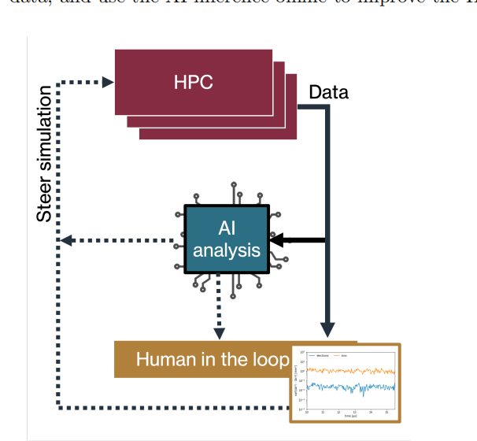
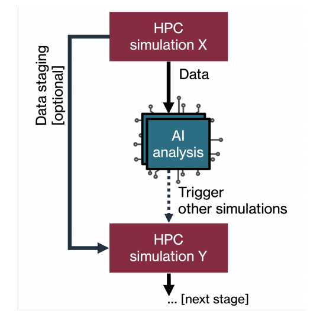
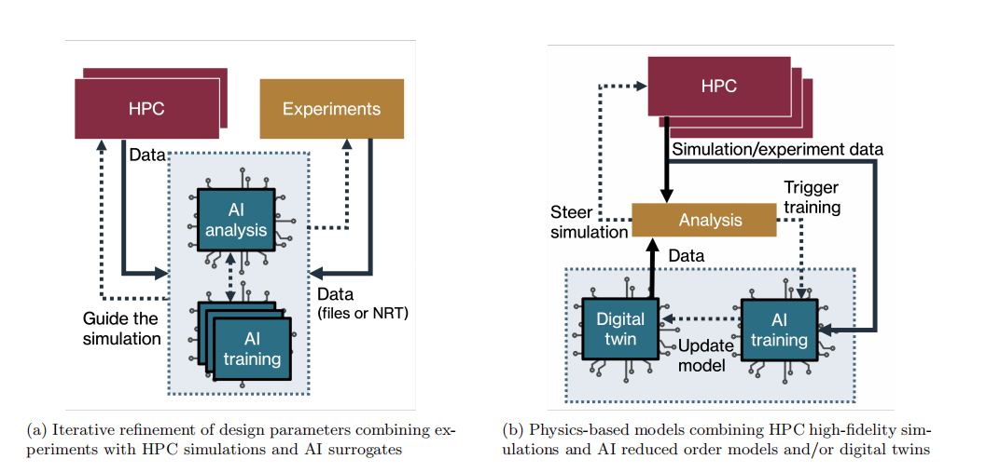
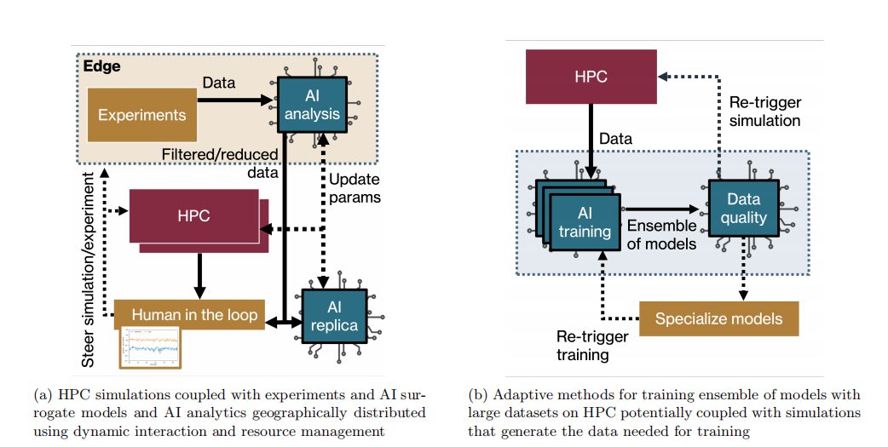

### **主要内容**：

- **AI-coupled HPC 三种耦合模式**：

  - **AI-in-HPC**： 指的是 AI 系统被引入来替代 HPC 模拟的一个组件，或者甚至整个模拟本身，即 AI 模型充当“完全代理”。

  - **AI-out-HPC**： 指的是 AI 系统位于传统 HPC 模拟循环之外，但可以动态控制 HPC 工作流程的进度（例如，通过强化学习控制计算战役）。

  - **AI-about-HPC**： 指的是 AI 系统与主要 HPC 任务并发且耦合：分析和训练代码使用 HPC 模拟的输出提供更深入的见解。

    

- **AI-coupled HPC 工作流程类型**

     文章定义了六种常见的执行模式，包括：

  - **Steering (引导)**: AI 系统控制 HPC 模拟的执行，例如选择下一个模拟或实验。
  - **Multistage Pipeline (多阶段管道)**: 通过 AI 进行过滤和分析，将工作流程分解成多个阶段。
  - **Inverse Design (逆向设计)**: 使用 AI 从观测数据中确定导致这些数据的原因。
  - **Digital Replica (数字副本)**: 使用 AI 模型 (如数字孪生) 进行科学预测和实验/模拟的健康监控。
  - **Distributed Models and Dynamic Data (分布式模型和动态数据)**: 在广域网中部署 HPC 模拟和实验，并使用 AI 进行分析和可视化。
  - **Adaptive Execution for Training Large AI Models (用于训练大型 AI 模型的自适应执行)**: 将 HPC 模拟和实验与大型 AI 模型的分布式训练相结合。

  

  

  

  

- **AI-coupled HPC 工作流程管理框架**：用于管理 AI-coupled HPC 工作流程的框架，例如 CANDLE、DeepDriveMD、MuMMI 和 IMPECCABLE 等。

- **性能挑战**： 文章讨论了 AI-coupled HPC 工作流程中的一些主要性能挑战，包括数据传输、模型训练、模型部署和互操作性等。

- **开放挑战和机遇**

     几个开放挑战和机遇，例如：

  - **硬件-软件融合**： 开发能够同时高效执行传统模拟和现代 AI 任务的新硬件和软件。
  - **数据和处理挑战**： 开发新的数据存储和访问模式，以支持 AI-coupled HPC 工作流程。
  - **基准测试**： 开发用于评估 AI-coupled HPC 工作流程性能的基准测试。
  - **跨领域问题**： 解决互操作性、能源效率和资源分配等跨领域问题。

### 关键挑战：

- **任务异构性**： 将 ML 方法与 HPC 模拟集成会导致任务异构性的增加。除了传统的 CPU、GPU 和多节点 MPI 任务外，ML 通常还需要执行高吞吐量函数调用，这些调用通常用 Python 等解释型语言实现，并可能依赖于分布在由不同组织和平台管理的存储库中的数据集。因此，管理工作流程应用程序执行的中间件必须能够同时调度、放置和执行具有不同执行生命周期的 MPI 可执行文件和 Python 函数——前者持续数小时，后者可能仅持续数秒。
- **自适应执行**： 使用 ML 在工作流程应用程序中的主要科学原因之一是提高对部分任务产生数据的分析能力。当某些任务进行时，可以使用 ML 模型来学习相关特征并更好地在运行时推动工作流程的进展。为了利用 ML 基于分析的潜力，工作流程应用程序必须变得自适应，即能够集成 ML 推理的结果并根据需要对工作流程图进行相应调整，并定义运行时执行的学习量，尤其是在执行之前无法预先知道该量的情况下：**模拟必须暂停并重新启动，使用新的起点，并且/或者根据 ML 推理的结果**，启动数量、类型或大小不同的模拟。
- **应用程序性能**： 为了使 ML 发挥作用，它必须能够有效地提高科学计算和执行性能。一方面，ML 建模和推理需要提高它所驱动的科学计算的准确性或物理模拟持续时间。另一方面，当 ML 集成到工作流程应用程序中时，它必须有效地使用可用的资源。资源效率取决于为了实现工作流程应用程序的既定目标而使用这些资源的时间，以及为了实现该目标而使用的可用资源的百分比。这意味着工作流程执行中间件必须以最大化资源利用率并最小化工作流程应用程序的总完成时间的方式来管理工作流程任务的同时执行。

### 现有解决方案评估：

- **Proxima**： Proxima 是一个 Python 库，用于包装 Python 函数。根据其输入，Proxima **计算何时通过代理模型进行推理或运行包装的函数**。通过代理模型进行推理通常比执行包装的函数更快，从而实现整体加速。Proxima 持续监控函数执行，动态调整代理配置参数并确定何时在运行时重新训练代理模型。尽管 Proxima 执行不同类型的函数（推理、监控、评估、配置和重新训练），但它不是针对 HPC 进行优化的，并且不会在大规模上并发执行这些不同的函数。Proxima 通过在运行时重新训练和参数化模型来实现自适应。最后，Proxima 作为 Python 库的性能是根据 Proxima 逻辑、模型（重新）训练、代理使用和推理来评估的。
- **Colmena**： Colmena 是一个通用的 Python 库，**用于在 HPC 计算系统上引导实验集合**。Colmena 设计用于执行不同类型的任务，包括：模拟、推理（通过代理模型）、模型训练和候选生成。与 Proxima 不同，Colmena 是针对 HPC 平台进行设计的，通过协调（可能并发的）执行不同类型的任务来解决异构性挑战。与 Proxima 类似，Colmena 通过代理参数化和（重新）训练来实现自适应。Colmena 使用 Parsl 作为其运行时系统，避免重新实现特定于 ML 的和通用目的的运行时功能。Colmena 的性能是通过通信开销（例如，请求或结果对象，以及数据输入或输出）来衡量的，并且根据不同的任务持续时间、结果大小和工作人员数量来衡量可扩展性能。
- **EXARL**： EXARL 是一个基于 OpenAI Gym 的 Python 框架，用于**实现任意强化学习 (RL) 算法并实现其大规模执行**。EXARL 实现了代理，每个代理都基于学习器/执行器架构，其中每个代理并发使用可扩展数量的学习器。学习器可以作为多进程或 MPI 可执行文件实现；可以同时执行多个代理。EXARL 没有为映射和启动其代理提供特定功能，而是依赖于第三方工具，例如批处理系统和 MPI 基础设施。因此，EXARL 不支持任务异构性，并且实现自适应需要在其代理之上进行编码。目前正在进行性能评估，衡量标准包括每个学习器的可扩展性，以及并发学习器和代理的数量。
- **MUMMI**： MUMMI 是一个 Python 工作流程管理器，用于**协调大规模多尺度模拟的执行**。MUMMI 允许协调宏观和微观尺度模拟任务的并发执行，并通过 ML 方法将它们耦合起来，以决定宏观尺度模拟的哪些空间应该由微观尺度模拟来探索。MUMMI 使用 Flux 作业调度程序来协调 CPU 和 GPU 上异构任务的调度和执行，并使用 Maestro 工作流程插件将其工作流程管理器组件与 Flux 连接。MUMMI 实现了自适应，允许在运行时（重新）训练 ML 模型并使用它们来控制模拟。MUMMI 的性能是通过资源利用率和并发模拟的数量来评估的。
- **IMPECCABLE**： IMPECCABLE 是一个药物发现管道，它在 CPU 和 GPU 上执行异构任务（即，MD 模拟、ML 训练和推理）。使用 RADICAL-Cybertools 作为工作流程中间件和运行时系统，它还使用 DeepDriveMD。IMPECCABLE 通过聚类 MD 轨迹来引导 MD 模拟集合来实现自适应。这可能包括启动新的模拟（即，扩大初始 MD 模拟池），或者杀死效率低下的 MD 模拟（即，卡在亚稳态的模拟）。IMPECCABLE 还支持运行时评估对接代理的培训。IMPECCABLE 的性能是根据资源利用率、框架的开销以及管道及其每个阶段的总完成时间来评估的。

### 未来发展方向：

- **中间件工程**： 逐步分离应用程序、框架、中间件和平台问题，以便在整个堆栈中支持 ML，而无需编写大量独立的解决方案，这些解决方案都实现了类似的功能。
- **框架集成**： 促进现有中间件解决方案之间的集成，以支持开发特定于领域的 ML 框架。尽管中间件层应该是与领域无关的，提供通用的资源和运行时管理功能，但领域科学家通常需要定制化编程模型和抽象的框架。
- **数据交换**： 开发能够在 HPC 平台上更有效地处理 ML 驱动的工作流程应用程序中的数据交换的技术，例如内存中数据共享和更高效的文件系统。
- **云和 HPC 资源整合**： 开发健壮且可靠的解决方案，以便将云和 HPC 资源整合到一起，从而能够在各种异构资源上无缝执行大规模、ML 驱动的工作流程应用程序。
- **基准测试**： 开发基准测试，以衡量 ML-HPC 工作流的执行和有效性能，并促进算法方法之间的比较以及评估未来平台架构对 ML 驱动工作流的效率。