#### 核心问题：

利用机器学习技术加速电力系统仿真，特别是交流最优潮流 (AC-OPF) 仿真，同时保证仿真结果的精度和鲁棒性。

#### 目前存在方法和局限性

**1. 用近似 NN 模型完全替代仿真求解器**：

   然而：

- **精度问题**： NN 模型只能提供近似的最优解，而不是精确解。这意味着最终解可能无法满足实际电力系统的需求，例如无法提供用户所需的电力。
- **可行性问题**： NN 模型可能产生不可行的解，即违反电力系统的物理约束，例如电压限制和线路容量限制。

**2. 识别激活约束以辅助现有求解器**：

  用 NN 模型来识别 OPF 问题中的激活约束，从而帮助现有求解器更快地收敛。然而：

- **精度问题**： NN 模型只能提供近似的最优解，而不是精确解。
- **经济性问题**： 由于 NN 模型只能提供近似解，因此可能需要多次运行求解器才能找到满意的解，从而造成额外的经济成本。

#### 提出的方法

先使用神经网络生成初始方案，然后再用 AC-OPF solver进行求解。如果NN给出的初始结果无法执行，会重新运行初始的Solver

#### 存在的挑战：

**1. 确定关键输入和输出变量**：

AC-OPF 仿真涉及许多变量，包括电压角度、电压幅值、发电机有功功率注入和发电机无功功率注入。如何确定哪些变量对仿真收敛和执行时间的影响最大，并量化这些变量的敏感性（重要性）。

只使用 AC-OPF 问题的解作为 NN 模型的唯一输出变量会导致仿真鲁棒性降低，因为初始解对仿真的指导有限。

**2. 保持仿真鲁棒性**：

AC-OPF 问题是非凸和非线性的，这意味着仿真过程本身存在不收敛的风险。使用 NN 模型生成初始解时，需要确保初始解是有意义的，并且不会影响原始仿真的收敛性。

**3. 保证 NN 预测的有效性**：

传统的 NN 模型通常是由计算机科学家手动构建的，缺乏领域知识，没有考虑领域需求。如何将电力系统的物理约束嵌入到 NN 模型中，以保证预测的有效性，并找出是什么在影响算法的结果。

#### 主要贡献：

Smart-PGSim ： 用于加速优化问题和 交流电最佳功率流量（AC-OPF）仿真。
神经网络模型构建技术： 构建鲁棒、准确且高性能的数值求解器的神经网络模型。
性能提升： 相比原始 AC-OPF 仿真方法，Smart-PGSim 平均加速 2.60 倍（最高可达 3.28 倍），同时保证最终解的最优性。

#### 相关工作

- OPF问题可以分为三种形式：经济调度（ED）、直流最优电力流（DC-OPF）和交流最优电力流（AC-OPF）问题。ED和DC-OPF问题是AC-OPF问题的简化版本。ED问题是移除AC-OPF问题中的一些约束，而DC-OPF问题则是通过线性化AC-OPF问题中的一些约束。

- 一般使用数值迭代算法来解决OPF问题。然而，当传输电力系统的规模变得很大时，这些算法的时间复杂度可能会非常高。

- Vaccaro等人使用主成分分析（PCA）来识别OPF变量之间的未知关系，从而减少了解决问题所需的变量数量。Ng等人采用基于统计学习的方法来建立输入电力需求与输出调度方案之间的映射。这些只考虑了预测的准确性，而没有考虑到OPF问题变量之间的相关性。

- Pan等人使用多层感知器（MLP）来学习DC-OPF问题中输入与决策之间的映射，并将其应用于获得任意输入下的优化操作决策。这种方法对于DC-OPF是有效的，但是它的泛化能力较低，无法应用于AC-OPF这样的非凸问题。

- 利用机器学习来加速AC问题的解决。Zamzam等人开发了一种基于机器学习的在线方法，通过加载最优发电机设定点并强制执行发电限制来获得AC问题的可行解。然而，AC电网包含的不仅仅是发电机功率的大小和反应部分，还有更多的电压相位角。

  

#### 关键技术：

敏感性分析： 确定对仿真收敛和执行时间影响最大的关键变量，并量化这些变量的敏感性。
多任务学习 (MTL) 模型： 利用 MTL 模型预测关键变量的初始值，提高模型精度并简化训练过程。
物理信息学习： 将电力系统的物理约束嵌入到 MTL 模型中，提高预测精度、可解释性和鲁棒性。

#### 问题建模

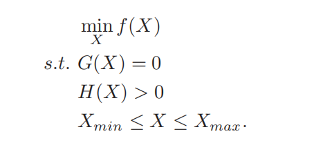

- f(X) 是目标函数，表示电力系统的运行成本。
- G(X) 是等式约束，表示交流节点功率平衡方程，可分为有功和无功部分。

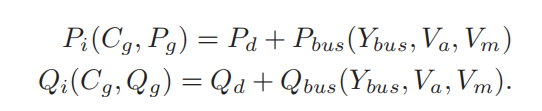

​		Cg是在电网中反映发电机位置的发电机连接矩阵；

​		Ybus 包含了电力网络中所有线路的阻抗信息，以及线路之间的耦合关系；

​		Pi 和 Qi 表示电力系统中每个节点的有功功率和无功功率注入量，有功功率是做功的功率，而无功功率是交换能量的功率；

​		Pd 和 Qd表示电力系统中所有负荷的总有功功率和无功功率消耗量；

​		Pbus 和 Qbus表示电力系统中所有线路的总有功功率和无功功率损耗量。

- H(X) 是不等式约束，表示基尔霍夫电压定律和线路负载限制。

- Xmin 和 Xmax 是变量 X 的上下界

- *X* = {Va;Vm; Pg; Qg}，

  **Va**：电压相位角。**Vm**： 电压幅值。

  **Pg**： 每个发电机的有功功率输出。**Qg**： 每个发电机的无功功率输出。

#### Smart-PGSim 框架工作流程：

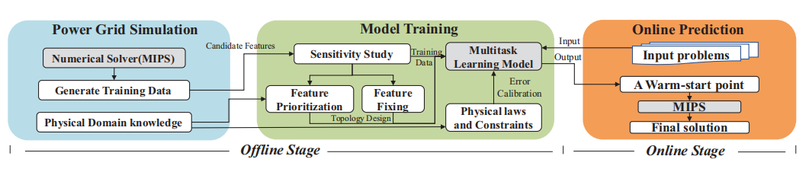

##### 离线阶段：

1. ##### 敏感性分析：

   寻找关键特征，并量化不精确变量（即有一定精度损失的变量）对仿真成功率和执行时间性能的影响；确定关键变量和变量之间的依赖关系；用于指导NN拓扑设计。

   通过success rate 和 sppedup 在不同系统中分析不同特征重要性。

   发现测试的四个特征是高度相互依赖的。

   通过特征之间的依赖性来决定特征的优先级，越多其他特征依赖于某个特征，其优先级越高。

2. ##### MTL 模型构建：

   根据敏感性分析结果，构建包含共享层和任务特定层的 MTL 模型。

   参数共享：避免过拟合；损失共享：避免局部最优。

   优先考虑特征以区分主要任务和辅助任务。主任务的成果会提噶准确率，辅助任务的成果会提高速度。交替的将不同任务的梯度传到共享层，实现主任务和副任务之间的交流和侧重。

   对于那些具有特定领域依赖性的特征应用基于物理的层次结构设计网络

   细节：使用Charbonnier loss

   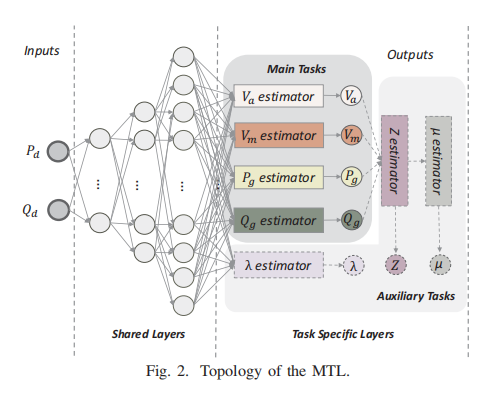

3. ##### 物理知识嵌入：

   将物理约束嵌入到 MTL 模型中，提高预测精度和鲁棒性。

   - 交流节点功率平衡方程

   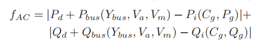

   - 将电网的模型输入（Pd、Qd）、输出（X、λ、μ、Z）和物理信息连接起来

   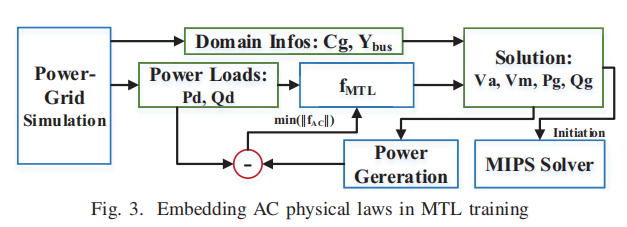

   - 对于不等式约束，使用指数损失函数来限制

   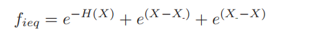

   - 代价最优化

   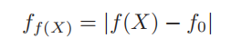

   - 将不等式和等式约束重构为软约束，并在损失函数中施加这些约束以指导训练。

   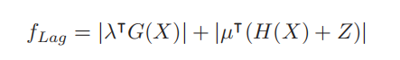

   - 将变量界限Z > 0和μ > 0视为硬约束，并应用激活函数来严格限制模型预测的范围。
   - 将上面函数的损失结合起来，结合监督学习和无监督学习

   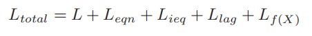

##### 在线阶段：

使用训练好的 MTL 模型预测关键变量的初始值。
将预测的初始值作为 AC-OPF 求解器的初始条件，加速仿真过程。

#### 数据

用**Matpower**进行模拟， Matlab Interior Point Solver (MIPS)作为求解器，测试5个电网系统，每个系统10000个样本。8：2训练测试。

#### 实验结果：

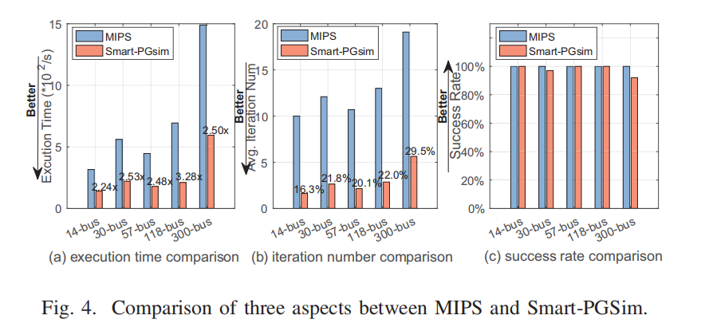

（迭代次数中只考虑Smart-PGSim中的迭代次数）

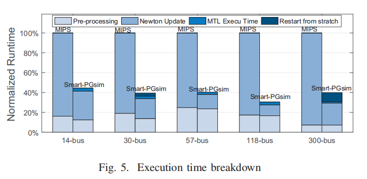

参数预测结果：λ和预期结果相差较大，因为λ是Eqn 3 中的等式约束因子。如果满足等式约束，则不会影响最终的收敛性

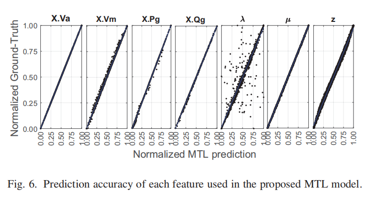

##### 比较

移除共享层；移除物理知识的嵌入

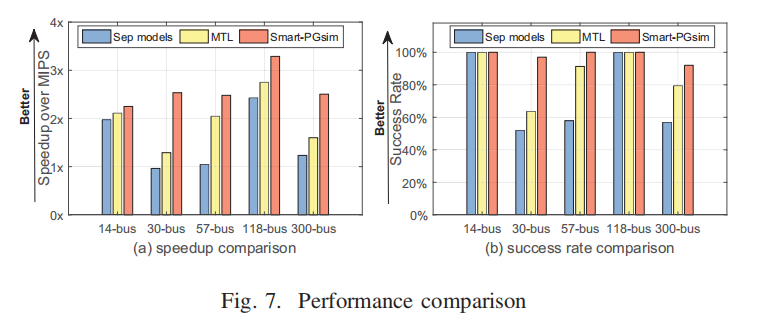

且相对误差更低

##### 扩展性测试

强可扩展性是在固定场景数量下测量的，而弱可扩展性则是随着处理器数量的增加而线性增加场景数量。

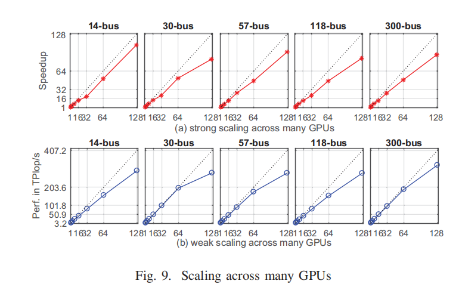

呈现出非线性特征：由工作分布策略引起的，虽然分布算法被设计为在gpu之间平均分配场景，但通信效应可能会扭曲这种平衡。具体来说，当在有8个GPU的节点上运行时，首先将MTL模型和数据复制到第一个GPU设备，然后利用GPUDirect和NVLINK复制到其他GPU，这将产生一些负载不平衡，从而导致效率损失。

##### 和最新成果对比

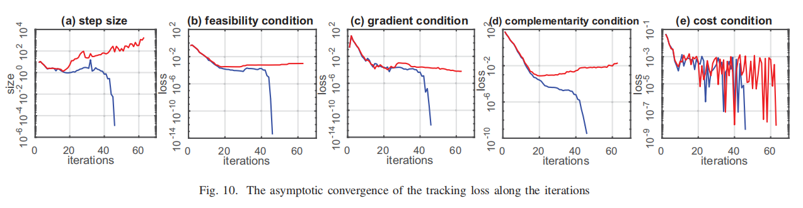

- Smart-PGSim 在 5 个测试系统上平均加速 2.60 倍（最高可达 3.28 倍），同时保证最终解的最优性。
- Smart-PGSim 的多任务学习和物理信息学习技术有效提高了预测精度和鲁棒性。
- Smart-PGSim 具有良好的可扩展性，可以在多节点系统上运行。

#### 讨论：

Smart-PGSim 的技术可以应用于其他科学计算领域，例如流体动力学仿真、分子动力学仿真和宇宙学建模。
Smart-PGSim 可以通过重新初始化求解器来处理不收敛的情况，从而保证最终解的最优性。

初始解会影响是否收敛和迭代次数，步幅也会影响。

部分情况无法收敛，但可以直接使用求解器

#### 结论：

Smart-PGSim 框架有效地利用机器学习技术加速了 AC-OPF 电力系统仿真，同时保证了仿真结果的精度和鲁棒性。该框架为利用机器学习技术加速其他科学计算应用提供了有价值的参考。

#### 涉及概念

##### **基尔霍夫电流定律 (Kirchhoff’s Current Law, KCL)**:

##### **原对偶内点法**

​	使用拉格朗日函数，通过引入松弛变量和障碍函数来转换原问题，并利用迭代方法同时优化原变量和对偶变量，最终收敛到最优解。

- **适用于非凸优化问题**： AC-OPF 问题是一个非凸优化问题，这意味着它没有全局最优解，并且可能存在多个局部最优解。原对偶内点法可以有效地解决这类问题，并找到全局最优解或接近全局最优解的局部最优解。
- **迭代求解**： 原对偶内点法是一种迭代算法，它通过不断迭代来逼近最优解。每次迭代都更新优化变量和拉格朗日乘子，并检查是否满足收敛条件。

##### Multitask learning（多任务学习）

它涉及到同时学习多个相关任务，而不是单独学习每个任务。在多任务学习中，共享表示（shared representation）被多个任务使用，这样可以在任务之间传递信息，提高模型的泛化能力和效率。

- **共享表示**：多任务学习模型通常包含一部分共享的神经网络层，这些层可以从多个任务中学习通用的特征表示。
- **任务特定表示**：除了共享层之外，模型通常也有特定于各个任务的层，用于捕捉每个任务独有的特征。

- **提高泛化能力**：通过共享表示，模型可以在相关任务之间共享有用的信息，这有助于提高在所有任务上的泛化能力。
- **减少过拟合**：多任务学习可以看作是一种正则化方法，因为它通过引入额外的任务来限制模型在单个任务上的复杂性。
- **数据效率**：当某些任务的数据量较少时，多任务学习可以利用其他任务的数据来提高表现。
- **知识共享**：在一个任务上学到的知识可以迁移到其他任务上，特别是在任务之间存在相关性时。

**实现方式**

- **硬参数共享**：所有任务共享同一个神经网络的一部分，例如在深度学习模型中的某些隐藏层。
- **软参数共享**：不同任务有各自的模型参数，但通过某些机制（如权重正则化）使得参数之间相互靠近。

##### Charbonnier loss

也称为Charbonnier函数或Charbonnier惩罚函数，是一种用于深度学习中的损失函数，特别是在图像处理任务中，如图像去噪、超分辨率和图像重建。

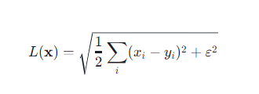

其中，x 是模型的预测值，y是真实值，ε是一个很小的常数，用来避免在x_i = y_i时损失函数的梯度为零。

**特点**

- **连续性和平滑性**：Charbonnier loss是一个连续和平滑的函数，这有助于在优化过程中获得更稳定的梯度。
- **对异常值的鲁棒性**：由于平方根的存在，Charbonnier loss对于较大的误差值相对不那么敏感，这有助于防止异常值对训练过程的影响。
- **灵活性**：通过调整ε的值，可以控制损失函数对误差的敏感度。

##### 敏感性分析

根据所采用的方法，敏感性分析可以分为不同的类型。例如，SALib库提供了几种灵敏度分析函数，如Sobol、Morris和FAST。这些方法的选择取决于特定应用的需求1。

一个具体的例子是对Ishigami函数进行Sobol敏感性分析。Ishigami函数因其强非线性和非单调性而被常用于测试不确定性和敏感性分析方法。该案例涉及以下步骤：

1. **导入库**：使用SALib库中的saltelli采样函数和sobol分析函数，以及Ishigami作为测试函数。
2. **定义模型输入**：Ishigami函数有三个输入，每个变量在特定范围内取值。
3. **采样和分析**：使用SALib进行采样和分析，计算敏感性指数1。