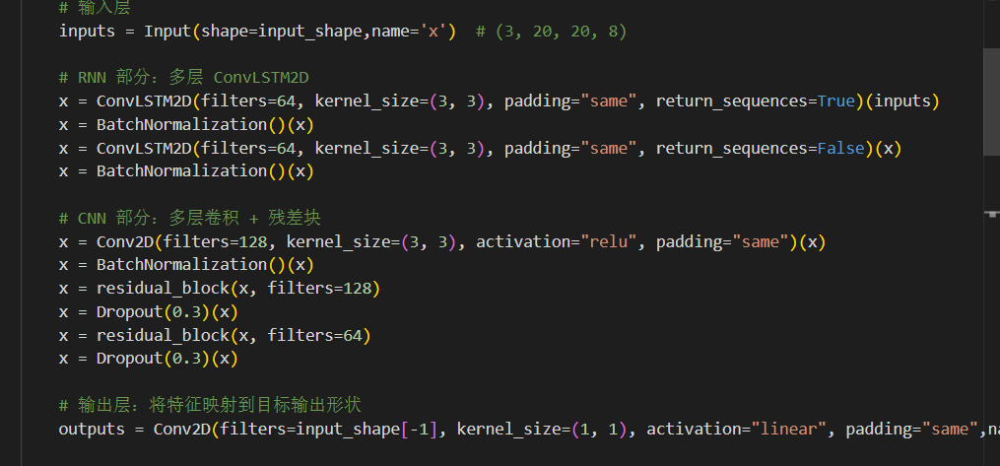

# 模拟场景

## Airfoils

- 个人评价：最常见的模拟，大部分文献使用。可能选择。
- Deep Learning Methods for Reynolds-Averaged Navier-Stokes Simulations of Airfoil Flows；
- 模拟不同飞机机翼、螺旋桨、风帆、旋翼、涡轮等部件的横截面形状的工作效用，其设计目的是在流体（通常是空气）中运动时产生升力，同时减少阻力。
- Airfoils模拟通过改变气流的速度和压力分布，使得翼面上下产生不同的压力，从而形成升力，从而支持飞行器在空中保持或改变姿态。不同的翼型设计适用于不同的飞行条件，比如对称翼型适合特技飞行，而非对称翼型通常能在正攻角下产生更大的升力。

##  **内流问题**

- 个人评价：少部分文章涉及，可能是比较简单
- 包括管道、通道或复杂几何内部的流动模拟，用于研究传热、混合和流动阻力等问题。
- 后向台阶流动（Backward-facing step flow）该案例主要研究由于几何突变（台阶）引起的流动分离与再附现象，是评估湍流模型在分离流预测方面的重要benchmark。
- 顶盖驱动腔体流（Lid-driven cavity flow）$FOAM_TUTORIALS/incompressible/icoFoam/cavity，最经典的内流算例之一，用于验证数值方法、网格质量以及流场中旋涡的形成和再附现象。
- 管道流（Pipe flow），$FOAM_TUTORIALS/incompressible/icoFoam/pipe， 该算例用于模拟管道内充分发展的流动，常用来验证速度剖面、壁面剪切应力等基本内流特性。

## 多相流与自由表面流动

- 个人评价：可能选择。略微复杂，具有一定挑战性，具有一定现实意义。

- 波浪、液体与气体交界处的自由表面问题，或泡沫、颗粒与流体的耦合问题。

- **damBreak 案例**，`$FOAM_TUTORIALS/multiphase/interFoam/damBreak`
  这个案例模拟水坝决堤问题，经典地展示了自由表面捕捉（VOF方法）在多相流中的应用。

- **自由表面波浪案例**`$FOAM_TUTORIALS/multiphase/interFoam/waveFoam`
  用于模拟波浪传播等自由表面流动现象，展示流体界面动态变化和波浪破碎等现象。

- **界面捕捉和高计算成本**：自由表面流动（如水坝决堤问题）中，VOF 方法需要对流体界面进行高精度捕捉，数值计算量较大。ML 方法可以用于预测局部界面演化或者辅助调整数值参数，从而降低整体计算成本。

  **数据丰富和模式重复性**：这种问题通常存在重复的流动模式（如波浪传播、界面分离与合并），适合利用历史计算数据进行训练，使得 ML 模型能够在相似场景下预测关键变量，从而实现加速收敛或者实时预报。

  **实验和仿真数据丰富**：多相流和自由表面流动问题在实验和仿真中都有大量数据积累，可以用来构建和验证机器学习模型的泛化能力。

- Experimental and numerical investigations of dam break flow over dry and wet beds

## 燃烧与反应流动

- 个人评价：可能选择。比传统场景更加复杂，涉及能量和热。google学术上搜索OpenFOAM combustion simulation，没找到使用ml进行加速的文章，更多的是数值方法研究

- 文章

  - 车内散热器，An Automated Computational Fluid Dynamics Workflow for Simulating the Internal Flow of Race Car Radiators
  - Development of a reduced mechanism for methane combustion inOpenFOAM: A computational approach for efficient and accurate simulations

-  **reactingFoam 案例**
   `$FOAM_TUTORIALS/combustion/reactingFoam`
  该案例涵盖了燃烧和反应流动的基本问题，如火焰传播和反应扩散问题，展示了反应机理和热释放对流动场的影响。

- **fireFoam 案例**

   `$FOAM_TUTORIALS/combustion/fireFoam`
  主要用于火灾模拟和火焰扩散问题，适合研究燃烧与热传递耦合的现象。

- **rhoReactingBuoyantFoam 案例**
   `$FOAM_TUTORIALS/combustion/rhoReactingBuoyantFoam`
   考虑密度变化与浮力作用的反应流案例，适用于研究火焰、烟气扩散等问题。

# 模型选择

- 扩散模型：Benchmarking Autoregressive Conditional Diffusion Models for Turbulent Flow Simulation
- U-Net：Deep Learning Methods for Reynolds-Averaged Navier-Stokes Simulations of Airfoil Flows
- cnn：Accelerating Eulerian Fluid Simulation With Convolutional Networks
- 强化学习：[DRLinFluids: An open-source Python platform of coupling deep reinforcement learning and OpenFOAM](https://pubs.aip.org/aip/pof/article/34/8/081801/2846652)

# 模型搭建思考

## 涉及时间递进

设计一个模型来替换 OpenFOAM 模拟中的内层循环（例如 PIMPLE 或 PISO 算法的内层循环）

1. **内层循环的作用**：
   
   - 内层循环的主要任务是通过迭代求解压力-速度耦合问题，确保流场满足动量方程和连续性方程。
   - 在 PIMPLE 算法中，内层循环包括以下步骤：
     1. 动量预测（`momentumPredictor`）。
     2. 压力修正（`pressureCorrector`）。
     3. 热物理修正（如果涉及热传递）。
     4. 附加物理模型修正（如湍流模型）。
   
2. **时间相关性**：
   
   - 内层循环通常在每个时间步内运行，时间步的推进由外层循环控制。
   - 时间相关性体现在动量方程和能量方程的时间导数项。
   
3. **替换模型的目标**：
   - 替换内层循环的模型需要能够模拟压力-速度耦合，并在每个时间步内更新流场和其他物理量。
   
     

##  **明确输入和输出**

- **输入**：
  - 当前时间步的流场状态（速度场 (U)、压力场 (p)、体积流量 (phi)、湍流耗散率（epsilon）、k（湍流动能）、nut（湍流粘性系数））。
  - 时间步长 (Delta t)
  - 边界条件和物理模型参数（如湍流模型参数、热物性参数等）
- **输出**：
  - 更新后的流场状态（如新的 (U)、(p)、(phi)）。
  - 其他物理量（如温度场 (T)、湍流动能 (k)、耗散率 (epsilon)）
- inputs (17, 3, 20, 20, 1, 7)  \# (num_samples, n_past, width, height, depth, field_dim)
  outputs (17, 20, 20, 1, 7) \# (num_samples,  width, height, depth, field_dim)

------

# 评价标准

- 已实现MSE，LSiM的代码和模型已经准备好
- a mean-squared-error (MSE) and LSiM, a similaritymetric for numerical simulations (Kohl et al. 2020, also see Appendix D).
- Benchmarking Autoregressive Conditional Diffusion Models for Turbulent Flow Simulation
  - **后验采样 (Posterior Sampling)**:
    - 后验采样是指在给定观测数据的情况下，从概率模型中抽取样本的过程。这有助于理解模型的不确定性。
  - **统计匹配 (Statistical Match)**:
    - 统计匹配是指模型预测的统计特性（如均值、方差等）与底层物理过程的统计特性相符合的程度。
  - **时间稳定性 (Temporal Stability)**:
    - 时间稳定性是指模型在长时间模拟中保持预测准确性的能力，不会随时间推移而发散。
  - **均方误差 (MSE, Mean Squared Error)**:
    - 均方误差是衡量预测值与实际值之间差异的一种方法，通过计算预测值与实际值之差的平方的平均值来得到。
  - **LSiM (Likelihood-based Similarity Measure)**:
    - LSiM是一种用于数值模拟的相似性度量，用于评估两个流场之间的相似程度。
  - **展开误差 (Rollout Errors)**:
    - 展开误差是指在时间序列预测中，每个时间步的预测误差。这些误差通常在每个时间步计算，然后在整个时间序列上进行平均。

# 代办

1. 时间加速比分析

2. 加速优化

   问题：目前openfoam和ml只使用到cpu进行计算，加速效果不明显，考虑简化模型结构和深度

3. 评估标准和比较

   问题：由于LSim只能比较(w, h, 1)或（w, h, 3）的数据相似性，考虑分别比对八个参数的相似性

4. dambreak案例中加入模型查看效果

   问题：现在的案例是一个块，但dambreak案例是多个块组成，转化成cnn时数据的布局应该怎么考虑
         一个块相当于一个可变型立方体。
   -blocks
    (
        hex (0 1 2 3 4 5 6 7) (30 30 1) simpleGrading (1 1 1)
    );
   -blocks
    (
        hex (0 1 5 4 12 13 17 16) (23 8 1) simpleGrading (1 1 1)
        hex (2 3 7 6 14 15 19 18) (19 8 1) simpleGrading (1 1 1)
        hex (4 5 9 8 16 17 21 20) (23 42 1) simpleGrading (1 1 1)
        hex (5 6 10 9 17 18 22 21) (4 42 1) simpleGrading (1 1 1)
        hex (6 7 11 10 18 19 23 22) (19 42 1) simpleGrading (1 1 1)
    );

# 已实现

1. 将面场投射到体积场，统一数据：将phi投射成phi_cell，处理nan值
  原因：面场和体积场的数据长度不同，面场表示的相当于是四边形的边，体积场表示的是四边形的中心。根据gpt的提示，按照openfoam的数据定义进行转化

2. 重构并裁剪数据：按百分比裁剪，并标准化数据，以达到减少数值单位影响的目的；将一维数据转化成适合CNN训练的二维数据
  原因：裁剪是因为数据输出时存在极大或极小的数据，影响数据质量

3. 模型搭建

   (1) 多层 `ConvLSTM2D

   - 增加了 `ConvLSTM2D` 的层数（2 层），以捕捉更复杂的时间序列关系。

   - 每层使用 `BatchNormalization`，以加速训练并稳定梯度。

   (2) 残差块

   - 使用了 `residual_block`，每个残差块包含 2 个卷积层和一个残差连接。

   - 残差连接可以缓解梯度消失问题，并提高深层网络的训练效果。

# 实验结果

## Model building

后续需要调整

## Simulation setting

- write_internal：1
- endtime：1
- deltatime：0.005
- total_step:200
- data_size:197
- 第一个实验中p的精度要求1e-06,其他参数精度1e-05；第二个实验中p的精度要求1e-10,其他参数精度1e-09

## Offline trainning

## Online simulation

Simulation time

- openfoam:ExecutionTime = 2.05601 s  ClockTime = 4 s；ExecutionTime = 2.65178 s  ClockTime = 5 s
- openfoam+ml: ExecutionTime = 2.08799 s  ClockTime = 10 s； ExecutionTime = 2.80402 s  ClockTime = 11 s
  - ClockTime 增加的可能原因：将数据提取出来给到模型和将模型的输出重新存到文件中占用时间
  - executiontime相差无几：计算量小；加载模型时间占比大
- speed-up:

# 涉及概念

- “攻角”是指机翼（或其它空气动力学物体）的弦线与相对气流方向之间的夹角。这个角度直接影响机翼产生升力的能力，因为气流沿着机翼表面流动时，其速度和压力分布会随着攻角的变化而改变。
- “高攻角”指的是攻角较大（通常大于临界攻角）的情况。在高攻角下，机翼可能会产生更大的升力，但同时也会伴随以下现象：
  - 流动分离与失速：当攻角过高时，气流难以紧贴翼面，可能会在机翼表面局部或大面积分离，导致升力骤降，这种现象称为失速。
  - 阻力增加：高攻角下产生的流动分离会导致压力阻力和诱导阻力增加，从而使整体阻力上升。
  - 非线性特性：在较低攻角时，升力与攻角呈近似线性关系；但在高攻角区域，由于流动分离和涡结构形成，升力与攻角的关系变得非线性。
